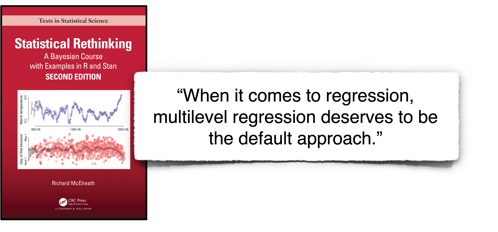
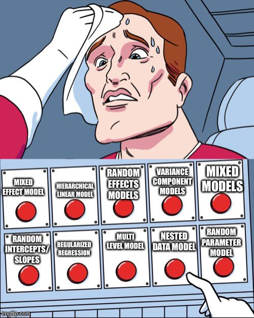
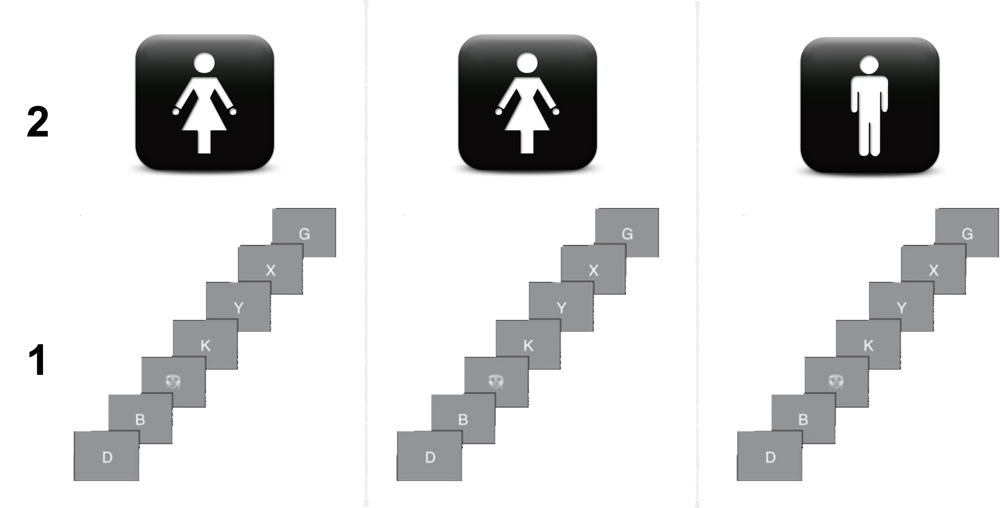
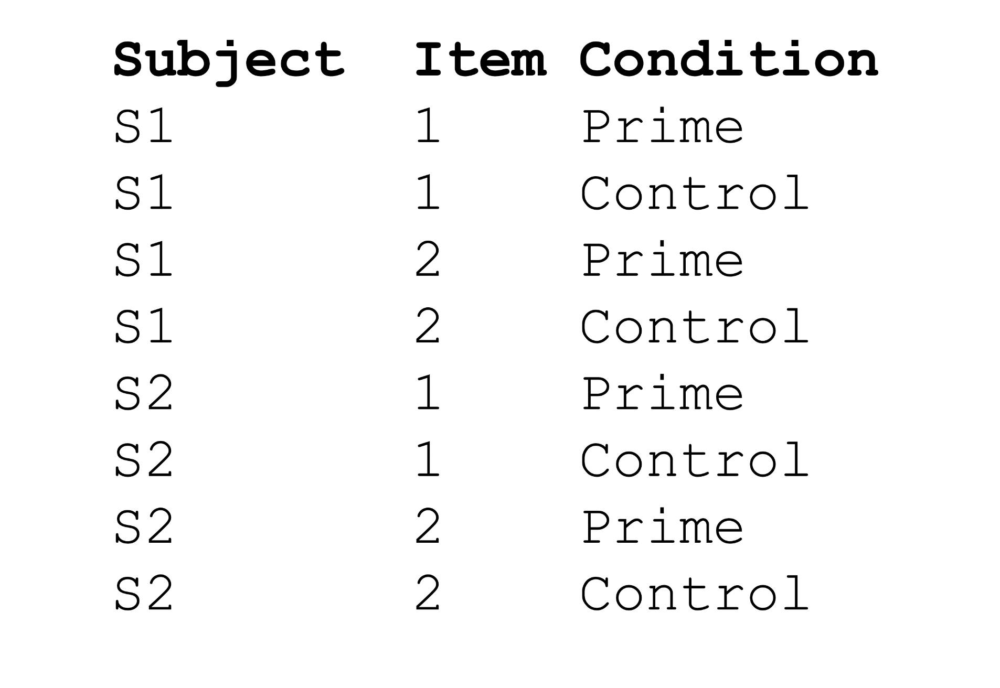
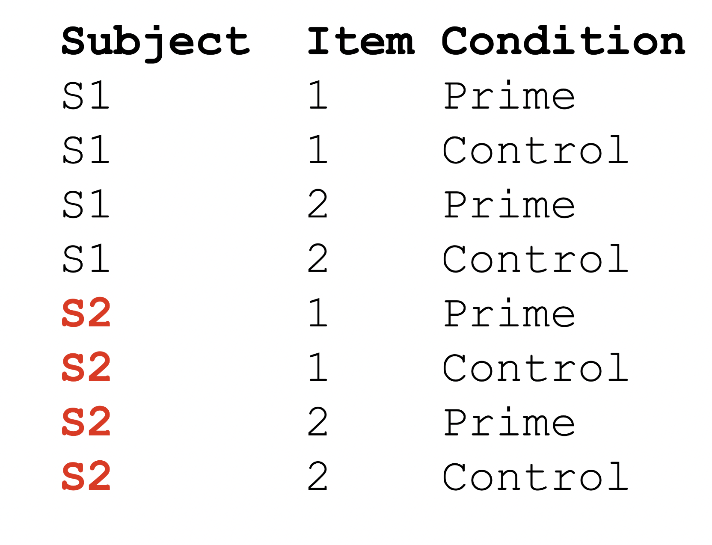
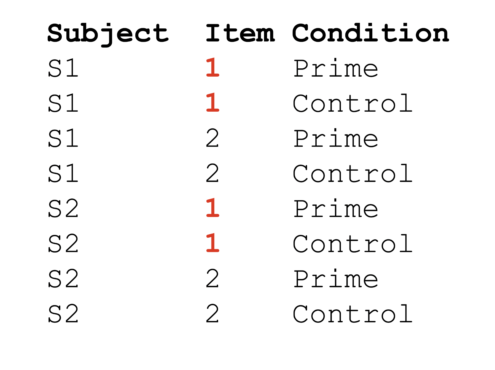
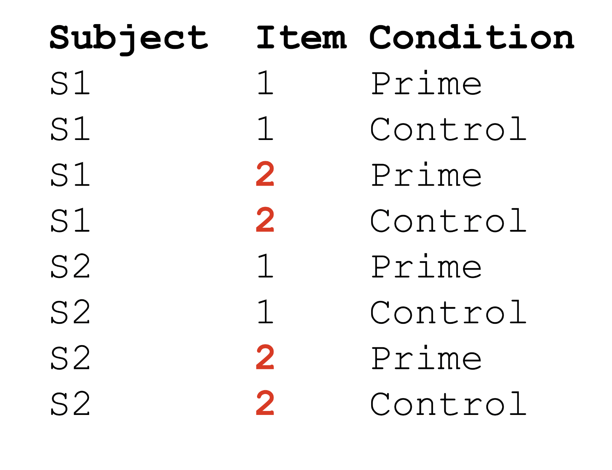
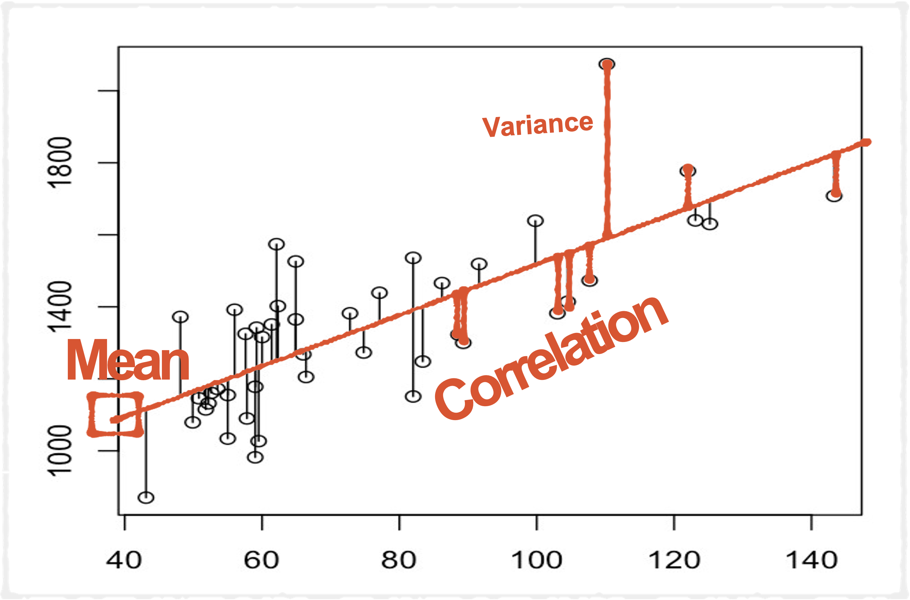
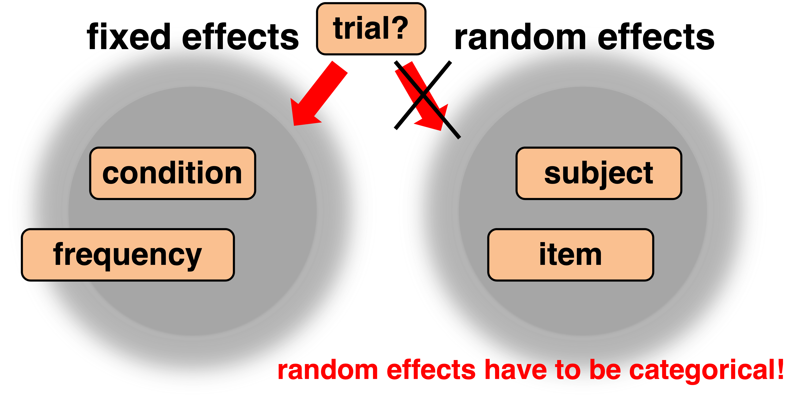

```{r xaringan-extra-styles, echo=FALSE}
library(xaringanExtra)
xaringanExtra::use_extra_styles(
  hover_code_line = TRUE,         #<<
  mute_unhighlighted_code = TRUE  #<<
)
```

```{r setup, include=FALSE}
options(htmltools.dir.version = FALSE)
knitr::opts_chunk$set(
  fig.width=9, fig.height=5, fig.retina=3,
  out.width = "80%",
  tidy.opts=list(width.cutoff=80),tidy=TRUE, 
  cache = FALSE,
  echo = TRUE,
  message = FALSE, 
  warning = FALSE,
  fig.show = TRUE,
  hiline = TRUE
)
hook_source <- knitr::knit_hooks$get('source')
knitr::knit_hooks$set(source = function(x, options) {
  x <- stringr::str_replace(x, "^[[:blank:]]?([^*].+?)[[:blank:]]*#<<[[:blank:]]*$", "*\\1")
  hook_source(x, options)
})
```

```{r xaringan-themer, include=FALSE, warning=FALSE}
library(xaringanthemer)
style_solarized_dark(
  header_font_google = google_font("Work Sans"),
  header_h1_font_size = "36px",
  header_color = "black",
  text_font_google = google_font("Work Sans"),
  text_font_size = "28px",
  text_color = "black", 
  background_color = "white", 
  code_font_google = google_font("Share Tech Mono"),
  extra_css = list(
    ".remark-slide-content h2" = list(
      "margin-top" = "2em",
      "margin-bottom" = "2em"
    ),
    .big = list("font-size" = "150%"),
    .small = list("font-size" = "75%"),
    .subtle = list(opacity = "0.6"),
    ".countdown-has-style h3, .countdown-has-style h3 ~ p, .countdown-has-style h3 ~ ul" = list(
      "margin" = "0"
    ),
    ".countdown-has-style pre" = list(
      "margin-top" = "-10px"
    ),
    "p .remark-inline-code" = list(
      "background-color" = "white",
      "padding" = "2px 2px",
      "margin" = "0 -2px"
    ),
    blockquote = list("margin-left" = 0),
    "em" = list(color = "#2aa198")
  ),
)
```

```{r, echo=FALSE}
library(parameters)
library(effectsize) 
library(lme4)
library(papaja)
library(tidyverse)
library(performance)
library(see)
library(equatiomatic)
library(broom.mixed)
library(afex)
library(kableExtra)
library(broom)
library(report)
library(emmeans)
library(flextable)
library(huxtable)
library(skimr)
library(scales)
library(sjPlot)
library(papaja)
library(moderndive)
library(tidyverse)
library(fivethirtyeight)
library(broom)
library(ggdist)
```
# Today

- Weekly Q&A

- Finish up logistic modeling

- Multilevel/Mixed Models

  - Introduction to MLM (connection to GLM)
  
  - How to do it
    - Organizing data for MLM analysis
    - Specifying MLMs
    - Fit and interpret multilevel models
    - Visualizing Data
    - Reporting
---
# R Chunks

- Include this code chunk at top of RMD file

  - Gets rid of all the messages and warnings
  
```{r setup1, eval=FALSE}

knitr::opts_chunk$set(
  echo = TRUE,
  message = FALSE, 
  warning = FALSE)
```
---
# Binomial vs. Bernoulli Distributions

- Bernoulli = A binomial distribution with 1 trial (*N*=1)
.pull-left[
```{r, echo=FALSE}
#install.packages(fivethirtyeight)
bechdel=fivethirtyeight::bechdel
bechdel %>%
  select(title, binary) %>%
  head()
```
]
.pull-right[
- Each row here is one trial

- There is only one outcome for each person (*N*=1): pass or fail

```{r, eval=FALSE} 

glm(pass~bechdel, data=data, family=binomial(link=logit))
```
]
---
# Binomial vs. Bernoulli

- Binomial 

  - Multiple trials per row

```{r, echo=FALSE}
"Framingham" <- structure(.Data = list(
"present" = c(2, 3, 3, 4, 3, 2, 0, 3, 8, 11, 6, 6, 7, 12, 11, 11), 
"absent" = c(117, 121, 47, 22, 85, 98, 43, 20, 119, 209, 68, 43, 
             67, 99, 46, 33), 
"SC" = structure(
   .Data = c(1, 1, 1, 1, 2, 2, 2, 2, 3, 3, 3, 3, 4, 4, 4, 4), 
    levels = c("<200", "200-219", "220-259", "260+"), class = "factor"), 
"BP" = structure(
    .Data = c(1, 2, 3, 4, 1, 2, 3, 4, 1, 2, 3, 4, 1, 2, 3, 4), 
    levels = c("<127", "127-146", "147-166", "167+"), class = "factor")), 
names = c("present", "absent", "SC", "BP"), 
row.names = c("1", "2", "3", "4", "5", "6", "7", "8", 
         "9", "10", "11", "12", "13", "14", "15", "16"), 
class = "data.frame")

```

```{r, eval=FALSE}
 glm(cbind(Y,N-Y) ~ X, 
       family = binomial,data=DataFrame)
```

- Doesn't really matter which one you use

  - I always use Bernoulli
---
# Drop-in-Deviance Test

- In standard logistic regression output, deviance test is analogous to F test in regression

- Can also use it for comparing different models to one another

---
# Interactions

- Use the interaction coefficient to check if there is a significant interaction

```{r, echo=FALSE}

evals_agegend=read_csv("https://raw.githubusercontent.com/jgeller112/psy503-psych_stats/master/evals.csv")
evals1= evals_agegend %>%
dplyr::select(ID, score, age, gender)

lm(evals1$score~age*gender, data=evals1) %>%
  tidy()

```
---
# ANOVA Assumptions

- Normality

```{r, eval=FALSE}

performance::check_normality()
```

- Homogenity of variance

```{r, eval=FALSE}
performance::check_homogeneity()
```

- Independence


---
# Odd's Ratios vs. Probability

- In logistic regression odd's ratios  are used as a measure of effect size

  - Can be hard to gauge sometimes
  
    - Couch it within probability

---
# Convert Odd's Ratios to Cohen's D

```{r}
odds_ratios=c(1.5, 2.0, 3.0)

log_odds <- log(odds_ratios)

cohen_d <- sqrt(3)*log_odds

cohen_d

```
---
# Logistic Activity

```{r}

data=read_csv("https://raw.githubusercontent.com/jgeller112/psy503-psych_stats/master/static/slides/14-Logistic_Regression/data/gss.csv")

```
Q: Does attitudes about premarital sex predict church attendence?

DV: Attended a religious service in the last week

Independent Variables:

  - Age

  - Sex

  - Socioeconomic Status (SES)

  - Negative attitudes toward  premarital sex

---
```{r, include=FALSE}
library(ggeffects)
data1 <- data %>%
  na.omit()

relig = glm(religious.attend~sex+age+ses+premarital.sex, data=data1, family="binomial")

plot(ggpredict(relig, "premarital.sex"), ci = FALSE, add.data = TRUE) 

plot_model(relig, type="pred", terms=c("premarital.sex")) + theme_bw() # pred is predictors 

```

# Report Logistic Regression

- State your hypothesis, statistical test, its link function, and
justify the use of a logistic regression

> We hypothesized that people who were against premarital
sex would be more likely to have attended a religious event
in the previous week. Religious event attendance was a
binary outcome as the person either attended an event or
they did not, which violated the normality assumption
required for traditional regression. Thus, a logistic
regression with a logit link function was used to model
religious event attendance using R 4.0.4 (R Core Team,
2020).


---
# Report Logistic Regression


- State the full model and your results, including the Odds Ratio


> Religious event attendance was modelled as a function of attitudes about premarital sex, controlling for the age, sex, and
socioeconomic status of the respondent. As shown in Figure 1, this analysis revealed that attitudes about premarital sex
significantly predicted religious event attendance, b = 0.72, SE
= 0.05, z(1303) = 13.24, p < 0.01, Odds Ratio = 2.05:1. This implies that every 1-unit increase in negative attitudes toward premarital sex predicted a 2-fold increase in the likelihood that the person had attended religious services in the previous week. Table 1 provides the model estimates for all predictors.

---
class: middle

# A Paradox

- Simpson's Paradox

```{r, echo=FALSE}
study <- c(50,53,55,53,57,60,63,65,63,67,70,73,75,73,77)
mcat <- c(77,76,77,78,79,73,74,73,75,75,63,64,65,66,70)
classroom <- c("A","A","A","A","A","B","B","B","B","B","C","C","C","C","C")

prep <- data.frame(study, mcat, classroom)

p <- prep %>% ggplot(aes(study,mcat)) 
ggplot(prep, aes(x = study, y = mcat))+
  geom_point2() +
  theme_lucid()

```
---
```{r}
p <- prep %>% ggplot(aes(study,mcat)) 
ggplot(prep, aes(x = study, y = mcat))+
  geom_point2(size=10) +
  theme_lucid() + 
  geom_smooth(method="lm")
```
---
```{r}
ggplot(prep, aes(x = study, y = mcat, color=classroom))+
  geom_point2(size=10) +
  theme_lucid() + 
   geom_smooth(method = "lm", se = FALSE)
```
---
```{r, echo=FALSE, fig.align='center', out.width="100%"}

```
---
# One Analysis, Many Names

```{r, echo=FALSE, fig.align='center', out.width="40%"}

```
---
# What are Multilevel Models?
<br>
<br>
<br>
- A broad class of analyses that deal with hierarchy in your data

---
# What is a “Hierarchy?”

*Clustering = Nesting = Grouping = Hierarchies*

- Key idea: More than one dimension sampling simultaneously

  - Repeated-measures and longitudinal designs

  - “Nested” designs

  - Any complex mixed design
  
*NO NEED FOR REPEATED ANOVA, MIXED ANOVA, ANCOVA*

---
# Repeated Measures Designs

```{r, echo=FALSE, fig.align='center', out.width="100%"}

```
---
# Repeated Designs
```{r, echo=FALSE, fig.align='center', out.width="100%"}

```
---
# Repeated Designs
```{r, echo=FALSE, fig.align='center', out.width="100%"}
knitr::include_graphics("images/repeat2.png")
```
---
# Repeated Designs
```{r, echo=FALSE, fig.align='center', out.width="100%"}

```
---
# Repeated Designs
```{r, echo=FALSE, fig.align='center', out.width="100%"}

```
---
# Repeated Designs
```{r, echo=FALSE, fig.align='center', out.width="100%"}

```
---
# Why MLM is Awesome #1

- Classic Analysis:

  - Aggregate to level of the group  (e.g., with means)

- Drawback of classic analysis: 

  - Loss of resolution!
  - Loss of power!

- MLM Approach:

  - Can analyze any complex data structure
---
# Longitudinal Designs

```{r, echo=FALSE, fig.align='center', out.width="100%"}
knitr::include_graphics("images/long_fixed.png")
```
---
# Why MLM is Awesome #2

- Classic Analysis:

  - Repeated-measures ANOVA  

- Drawback of this approach:

  - Missing Data

    - Must exclude entire people OR, you can interpolate missing  data

- MLM Approach:

  - Can analyze all the observations you have!

---
# Nested Designs

```{r, echo=FALSE, fig.align='center', out.width="70%"}
knitr::include_graphics("images/nestingdolls.webp")
```

---
# Two-level Hierarchy

- Nested designs

```{r, echo=FALSE, fig.align='center', out.width="100%"}
knitr::include_graphics("images/nested.png")
```
---
# Three-level Hierarchy

```{r, echo=FALSE, fig.align='center', out.width="100%"}
knitr::include_graphics("images/2level.png")
```

- For now we will focus on data with two levels:

  - Level one: Most basic level of observation
  - Level two: Groups formed from aggregated level-one observation
---
# Crossed vs. Nested Designs

- Crossed Designs

```{r, echo=FALSE, fig.align='center', out.width="100%"}
knitr::include_graphics("images/crossed_data.png")
```

---
# Why MLM is Awesome #3

- Classic Analysis:

  - Repeated-measures ANOVA  
  
- Drawback of ANOVA:

  - Only use categorical predictors

- MLM Approach:

    - Can use any combo of categorical and continuous predictors!
---
# Broad Intro

- Multilevel Models are linear models with extra error terms

- *Understand regression/GLM, and you can do any MLM*
---
# LM

$$y = b_0 + b_1*x + e$$

```{r, echo=FALSE, fig.align='center', out.width="50%"}

```


---
# Explaining Variance is the Grand Prize

- Almost any classical statistic compares:


  $$\frac{Variance {Explained} }{Unexplained}$$
---
# One Source of Variance

$$y = b_0 + b_1*x + e$$
```{r, echo=FALSE, fig.align='center', out.width="50%"}

```

---
# Assumptions of LM

- Assumptions:

  - Normality
  - Homosecdacisity
  - Independence
  - No Multicollinearity
  - No missing data
---
# Violations of Assumptions

- Transform them, if you can

- Use robust SEs

- Accept a decrease in statistical power, if you can  

- Find a test that doesn’t require that assumption

---
# Key Assumptions Relative to MLM

- **All observations must be independent**

  -  Residuals are expected to be independent of each  other and normally-distributed

- **No missing data**

---
# But The World is Interdependent!

```{r, echo=FALSE, fig.align='center', out.width="100%"}
knitr::include_graphics("images/interdep.png")
```
---
# Multilevel Models

- When to use them:

  - Within-subjects data
  
  - Mix of between- and within-subjects data
  
- Why use them:

  - Captures variance occurring between groups and within groups
  
- What they are:

  - Linear model with extra residuals
---
# Jumping Right In

- Words you hear constantly in  MLM Land:

  - *Fixed effects*
  - *Random effects*
  - *Random intercepts*  
  - *Random slopes*
  
- What do they mean?

---
# Fixed and Random Effects

- **Fixed effect**: 

  - Population-level (i.e., average) effects that should persist across experiments
  
  - Usually experimental manipulations
  
  - Can be continuous or categorical
---
# Fixed and Random Effects

- **Random effects**:

  - Randomly sampled observations over which you plan to generalize

      - Participants
      - Words
      - Pictures
      
  - Can help account for individual variation
  
---
# Fixed and Random Effects

```{r, echo=FALSE, fig.align='center', out.width="100%"}
knitr::include_graphics("images/fixedxvsran.png")
```
---
```{r, echo=FALSE, fig.align='center', out.width="100%"}
knitr::include_graphics("images/age.png")
```
  
---

```{r, echo=FALSE, fig.align='center', out.width="100%"}
knitr::include_graphics("images/age1.png")
```

---
```{r, echo=FALSE, fig.align='center', out.width="100%"}

```

---
## Practice

.question[
Radon is a carcinogen – a naturally occurring radioactive gas whose decay products are also radioactive – known to cause lung cancer in high concentrations. The EPA sampled more than 80,000 homes across the U.S.  Each house came from a randomly selected county and measurements were made on each level of each home.  Uranium measurements at the county level were included to improve the radon estimates.

1. What is the most basic level of observation (Level One)? 
2. What are the group units (Level Two, Level Three, etc...)
2. What is the response variable?
3. What are the fixed effects? What are the random effects?
]

```{r echo = F}
library(countdown)
countdown(minutes = 3, seconds = 00,
          margin = "1.25%")
```
---
# OLS Approach

- Fixed effects model

```{r, echo=FALSE, fig.align='center', out.width="60%"}

rt_data <- read_csv(here::here("static","slides", "15-MLM", "data", "rt_dummy_data.csv"))

figuredata<- read_csv(here::here("static","slides", "15-MLM", "data", "figure_data.csv"))

figuredata$PID <- as.factor(figuredata$PID)

ols.mod <- lm(yvar ~ xvar, data = figuredata)

ggplot(figuredata, aes(x = xvar, y = yvar)) + 
  stat_smooth(method = lm, se = FALSE, linetype = "solid", 
              color = "black", size = .6) +
  geom_point(aes(shape = PID), size = 3.25, color = "red") +
  scale_shape_manual(values = c(15, 16, 17, 18)) + 
  geom_segment(aes(x = xvar, xend = xvar, 
                   y = yvar, yend = fitted(ols.mod)), 
               color = "red") +
  scale_y_continuous(expand = c(0, 0), breaks = c(0, 750, 1500, 2250, 3000), 
                     limits = c(0, 2600)) +
  scale_x_continuous(expand = c(0, 0), breaks = c(0, 2, 4, 6, 8, 10), 
                     limits = c(-0.5, 10.5)) +
  theme(panel.background = element_blank(),         
        panel.grid.major = element_blank(),
        panel.grid.minor = element_blank(),
        panel.border = element_rect(colour = "black", fill = NA),
        legend.position = "none",
        axis.text = element_text(size = 14),
        axis.title = element_text(size = 14)) +
  labs (x = "Word Difficulty", y = "Response Time") 
```

---
# Random Intercepts


.pull-left[
```{r, eval=FALSE}
library(lme4)

lmer(DV ~ IV + IV2 (1|participant))

```


]

.pull-right[
```{r, echo=FALSE, fig.align='center', out.width="100%"}
random_intercepts.mod <- lmer(yvar ~ 1 + xvar + (1|PID), data = figuredata)

model_intercept <- as.numeric(fixef(random_intercepts.mod)[1])
model_slope <- as.numeric(fixef(random_intercepts.mod)[2])

figuredata$intercepts <- rep(coef(random_intercepts.mod)$PID[,1], each = 4)

ggplot(figuredata, aes(x = xvar, y = yvar)) + 
  geom_abline(slope = model_slope, intercept = model_intercept, 
              linetype = "solid", color = "black", size = 1) +
  geom_abline(mapping = aes(slope = model_slope, intercept = intercepts), 
              linetype = "dashed", color = "red", size = .4) + 
  geom_point(aes(shape = PID), size = 3.25, color = "red") + 
  scale_shape_manual(values = c(15, 16, 17, 18)) + 
  geom_segment(aes(x = xvar, xend = xvar, 
                   y = yvar, yend = fitted(random_intercepts.mod)),
               color = "red") +
  scale_y_continuous(expand = c(0, 0), breaks = c(0, 500, 1000, 1500, 2000, 2500), 
                     limits = c(0, 2600)) +
  scale_x_continuous(expand = c(0, 0), breaks = c(0, 2, 4, 6, 8, 10), 
                     limits = c(-0.5, 10.5)) +
  theme(panel.background = element_blank(),         
        panel.grid.major = element_blank(),
        panel.grid.minor = element_blank(),
        panel.border = element_rect(colour = "black", fill = NA),
        legend.position = "none",
        axis.text = element_text(size = 14), 
        axis.title = element_text(size = 14)) +
  labs (x = "Word Difficulty", y = "Response Time") 
```
]
---
# Random Intercepts and Slopes

*You should only use a random slope for a fixed effect if the fixed effect varies within the grouping factor*

.pull-left[

```{r, eval=FALSE}
library(lme4)

lmer(DV ~ IV + IV2 (1+IV1|participant))

```
]

.pull-right[
```{r, echo=FALSE, fig.align='center', out.width="100%"}

random_slopes.mod <- lmer(yvar ~ 1 + xvar + (1 + xvar|PID), data = figuredata)
figuredata$intercepts2 <- rep(coef(random_slopes.mod)$PID[,1], each = 4)
figuredata$slopes <- rep(coef(random_slopes.mod)$PID[,2], each = 4)

ggplot(figuredata, aes(x = xvar, y = yvar)) + 
  geom_abline(slope = model_slope, intercept = model_intercept, 
              linetype = "solid", color = "black", size = 1) + 
  geom_abline(mapping = aes(slope = slopes, 
                            intercept = intercepts2, linetype = PID), 
              linetype = "dashed", color = "red", size = .4) +
  geom_point(aes(shape = PID), size = 3.25, color = "red") + 
  scale_shape_manual(values = c(15, 16, 17, 18)) + 
  geom_segment(aes(x = xvar, xend = xvar, 
                   y = yvar, yend = fitted(random_slopes.mod)), 
               color = "red") +
  scale_y_continuous(expand = c(0, 0), breaks = c(0, 750, 1500, 2250), 
                     limits = c(0, 2600)) +
  scale_x_continuous(expand = c(0, 0), breaks = c(0, 2, 4, 6, 8, 10), 
                     limits = c(-0.5, 10.5)) +
  theme(panel.background = element_blank(),         
        panel.grid.major = element_blank(),
        panel.grid.minor = element_blank(),
        panel.border = element_rect(colour = "black", fill = NA),
        legend.position = "none", 
        axis.text = element_text(size = 14),
        axis.title = element_text(size = 14)) +
  labs (x = "Word Difficulty", y = "Response Time") 
```
]
---
# Random Coefficents

- Estimated per group

  - Level 1 units used to estimate each group’s random slopes & intercept

---
# How Do Your Groups Differ?

- Different averages

  - **Random intercept**
      - Each group gets its own intercept
    
- Different relationships between x and y

  - **Random Slope**
      - Each group gets its own slope
      - Only if var differs within subject
    
- Per-group slopes and intercepts are represented with new residuals

---

```{r, echo=FALSE, fig.align='center', out.width="100%"}
knitr::include_graphics("images/randomeq.png")


```

```{r, echo=FALSE, fig.align='center', out.width="100%"}
knitr::include_graphics("images/ranslopes.png")

```
---
# Implications

- Multiple sources of variance?

  - Just add more residuals!

- Each source of variance gets its own residual term  

  - Residuals capture variance

  - Residuals are added rendering them conditionally independent

    - Otherwise, MLM is the same as GLM
---
# How Are They “The Same"

- The fixed effects (usually) hold your hypothesis tests

  - Fixed effects output:  Looks like GLM output

- Can (essentially) be interpreted like GLM output  For most people, this is all that matters

---
# How Are LM and MLM Different?

- MLM has random effects output

  - Variance explained by the random effect

  - This may be interesting, in and  amongst itself

- Fixed effects of random terms are the average estimates across groups

- Fixed effects and random effects are conditionally independent

---
class: middle

Note: 
# Golden Rule: Should have > 5 levels per random effect
---
# Number of Random Effects

The size of the groups affects how many random effects can be estimated for each group

Max random coefficients = ((# level 1 observations)/  group) - 1

---
# All Together

- In regression you just estimate the outcome, $y$

- In MLM, you estimate parameters on the right side of the  equation, too:

  - Intercept: $b_0$  
  
  - Slopes: $b_1$, $b_2$
---

```{r, echo=FALSE, fig.align='center', out.width="100%"}
knitr::include_graphics("images/EQ.png")
```

---
- Level 1: 
$$y_{ij} = \beta_{0j} + \beta_{1j}x_{ij} + e_{ij}$$
- Level 2: 

  - Multilevel Equation

          - Predicted Intercept: 

$$\beta_{0j} = \beta_{0} + u_{0j}$$

          - Predicted Slope: 

$$\beta_{1j} = \beta_{1} + u_{1j}$$
- Mixed Model Equation

$$y_{ij} = (\beta_{0} + u_{0j}) + (\beta_{1} + u_{1j})x_{ij} + e_{ij}$$
---
# Error Terms

- Captures all unexplained variance: $y_{ij} - y$

- We want to explain more of it by considering groups, $y{ij}$ - $y_j$

- Since each group j has its own intercept and/or slope, you are more accurate at predicting $y_{ij} for any individual in the group

- Moreover, you are now accounting for the shared variance among group members

- Each new residual makes additional sources of variance conditionally independent

