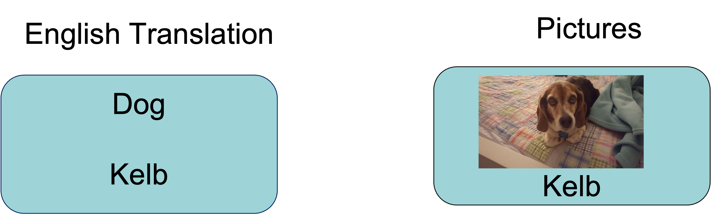
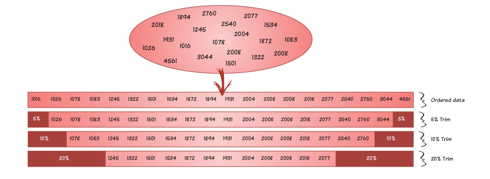
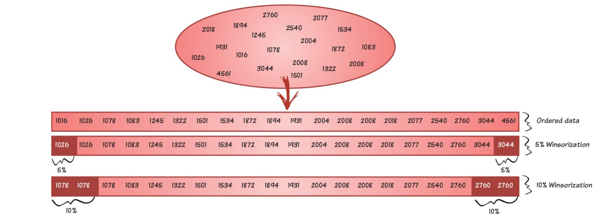
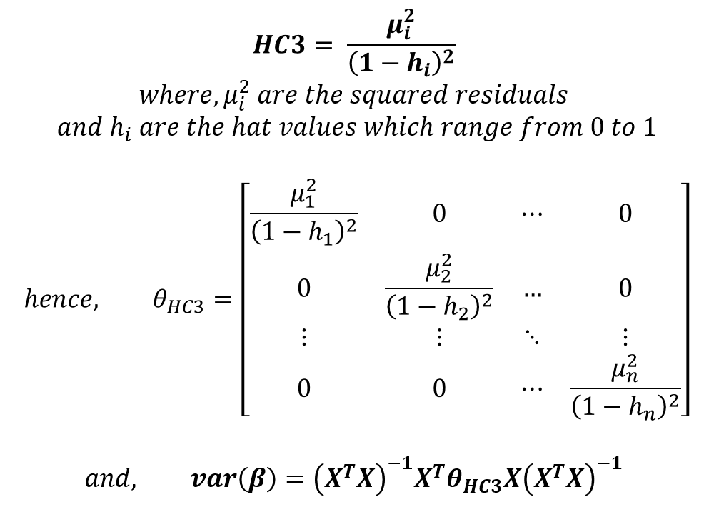

```{r xaringan-extra-styles, echo=FALSE}
library(xaringanExtra)
xaringanExtra::use_extra_styles(
  hover_code_line = TRUE,         #<<
  mute_unhighlighted_code = TRUE  #<<
)
```


```{r setup, include=FALSE}
options(htmltools.dir.version = FALSE)
knitr::opts_chunk$set(
  fig.width=6, fig.height=4, fig.retina=3,
  out.width = "100%",
  tidy.opts=list(width.cutoff=60),tidy=TRUE, 
  cache = FALSE,
  echo = TRUE,
  message = FALSE, 
  warning = FALSE,
  fig.show = TRUE,
  hiline = TRUE
)
hook_source <- knitr::knit_hooks$get('source')
knitr::knit_hooks$set(source = function(x, options) {
  x <- stringr::str_replace(x, "^[[:blank:]]?([^*].+?)[[:blank:]]*#<<[[:blank:]]*$", "*\\1")
  hook_source(x, options)
})
```

```{r xaringan-themer, include=FALSE, warning=FALSE}
library(xaringanthemer)
style_solarized_dark(
  header_font_google = google_font("Work Sans"),
  header_h1_font_size = "36px",
  header_color = "black",
  text_font_google = google_font("Work Sans"),
  text_font_size = "28px",
  text_color = "black", 
  background_color = "white", 
  code_font_google = google_font("Share Tech Mono"),
  extra_css = list(
    ".remark-slide-content h2" = list(
      "margin-top" = "2em",
      "margin-bottom" = "2em"
    ),
    .big = list("font-size" = "150%"),
    .small = list("font-size" = "75%"),
    .subtle = list(opacity = "0.6"),
    ".countdown-has-style h3, .countdown-has-style h3 ~ p, .countdown-has-style h3 ~ ul" = list(
      "margin" = "0"
    ),
    ".countdown-has-style pre" = list(
      "margin-top" = "-10px"
    ),
    "p .remark-inline-code" = list(
      "background-color" = "white",
      "padding" = "2px 2px",
      "margin" = "0 -2px"
    ),
    blockquote = list("margin-left" = 0),
    "em" = list(color = "#2aa198")
  ),
)
```

```{r, echo=FALSE}
library(parameters)
library(effectsize) 
library(papaja)
library(tidyverse)
library(performance)
library(see)
library(equatiomatic)
library(kableExtra)
library(broom)
library(report)
library(emmeans)
library(flextable)
library(huxtable)
library(skimr)
library(papaja)
library(moderndive)
library(tidyverse)
library(fivethirtyeight)
library(broom)
library(ggdist)
```
# Today

- Adding more tools to your toolbox

  - Trimming
  
  - Winsorizing
  
  - **Bootstrapping**
  
  - **Permutation Tests**
  
- How to do these things in R
---
# The Problem

- Commonly used statistical tests make assumptions

  - No outliers
--

  - Normally distributed (residuals)
  
--
  - Homogeneity/Homoscedasticity

---
# Population Paramter Estimates

We know: 

- Best estimate of a population mean 

$$\mu = \bar X$$

- The sd of sampling distribution of means is the standard error of mean

$$SE_{mean} = \frac{s_x}{\sqrt(n)}$$
- We can use this to generate 95% CIs

$$\bar X +- t_{\alpha}(s_{\bar X})$$
---
# Bias

- Extreme scores and non-normality can bias our results

  - Expected value > or < population parameter

- Bias population parameters:

  - $\mu$ 
  - $\sigma_2$ 
  - $SE_M$ 

---
# Example

<br>
<br>

.pull-left[

```{r, echo=FALSE, fig.align='center'}



```
]


.pull-right[

```{r, echo=FALSE, fig.align='center', out.width="60%", fig.cap="Carpenter and Geller (2019). Foreign language learning with pictures vs. word translations" }

rts<-read_csv("/Users/jasongeller/Documents/03-Robust_Methods/data/rt_means.csv")

rts_wide <- rts %>%
  pivot_longer(RTWordMean:RTPicMean)

# visualize the distribution of the continuous variable for each group using a boxplot
ggplot(rts_wide, aes(x = name, y = value, fill=name)) +
  geom_bar(stat="identity") +
  theme(legend.position = "none") +
  labs(x = "Condition", y = "RTs")

```
]


---

<br>
<br>
<br>

.pull-left[
```{r, echo=TRUE, fig.align='center', out.width="100%"}
# visualize the distribution of the continuous variable for each group using a boxplot with jittered raw data points
# and highlighting the outlier with a red square

rt_fig <- rts_wide %>% 
    ggplot(aes(name, value, colour = name, fill = name)) +
    stat_slab(trim = FALSE, colour = "white",
              position = position_nudge(y = 0.3), scale = 0.5) +
    geom_boxplot(width = 0.1, fill = "white", colour = "black", size  = 0.75,
                 outlier.colour = NA, position = position_nudge(y = 0.3)) +
    geom_point(shape = 1, stroke = 1, size = 2.5, alpha = 0.5,
               position = position_jitter(height = 0.1), show.legend = FALSE) +
    labs(x = "Condition", y = "RTs") +
    guides(colour = "none", fill = "none") +
    theme(axis.title.y = element_blank()) + 
   labs(x = "Condition", y = "RTs")

```
]

.pull-right[

```{r, echo=FALSE, fig.align='center', out.width="100%"}

rt_fig <- rts_wide %>% 
    ggplot(aes(name, value, colour = name, fill = name)) +
    stat_slab(trim = FALSE, colour = "white",
              position = position_nudge(y = 0.3), scale = 0.5) +
    geom_boxplot(width = 0.1, fill = "white", colour = "black", size  = 0.75,
                 outlier.colour = NA, position = position_nudge(y = 0.3)) +
    geom_point(shape = 1, stroke = 1, size = 2.5, alpha = 0.5,
               position = position_jitter(height = 0.1), show.legend = FALSE) +
    labs(x = "RTs", y = "Condition") +
    guides(colour = "none", fill = "none") +
    theme(axis.title.y = element_blank()) + 
   labs(x = "Condition", y = "RTs")

rt_fig

```

]
---
# What can we do?

--

  - Transforming data?
  
--

  - Trimming the data?
  
--

  - Winsorizing?
  
--

  - Bootstrapping?
  
--

  - Permutation tests?
  
---
# Trimming Data

- Order data

  - Remove highest and lowest 5%, 10%, or 20% 
  
- Can use base `mean` function with trim argument `mean(x, trim=.2)`

```{r, echo= FALSE, fig.align='center', out.width="90%"}

```

---
# Back to our example

- What happens if we trim 20%?

```{r}


rts_wide_trim <- rts_wide %>%
  group_by(name) %>%
  summarise(mean=round(mean(value), 0),  trim_20=round(mean(value, trim=.2), 0))

as.data.frame(rts_wide_trim, scientific = FALSE)

```
---

<br>
<br>

.pull-left[
```{r, echo=FALSE, fig.align='center', out.width="100%"}
ggplot(rts_wide, aes(x = name, y = value)) +
  geom_bar(stat="identity") + 
  ggtitle("Raw Means")
```
]

.pull-right[
```{r, echo=FALSE, fig.align='center', out.width="100%"}
# visualize the distribution of the continuous variable for each group using a boxplot
ggplot(rts_wide_trim, aes(x = name, y = trim_20)) +
  geom_bar(stat="identity") +
  ggtitle("Trimmed Means")

```
]
---
# Winsorizing

- Instead of removing points, we can replace them with nearest score

```{r, echo= FALSE, fig.align='center', out.width="100%"}

```

---
# Winsorizing

```{r, eval=TRUE}
library(datawizard)

rts_wide_table <- rts_wide %>%
  group_by(name) %>%
  summarise(win=datawizard::winsorize(value))


  knitr::kable(head(rts_wide_table), format = 'html')

```
---
# Winsorized Correlations

.pull-left[
```{r}
library(ggplot2)

# Create a dataset with two variables that are not correlated
set.seed(0)
x <- rnorm(100)
y <- rnorm(100)

# Add an outlier to the dataset
x <- c(x, 3)
y <- c(y, 3)
```
]

.pull-right[

```{r, echo=FALSE}
# Create a scatterplot to visualize the relationship between the variables
df <- data.frame(x = x, y = y)
ggplot(df, aes(x = x, y = y)) + geom_point()

```

]
---
# Winsorized Correlations

```{r, out.width="60%"}
#winsorized correlation 20%
#easystats correlation package 

correlation::correlation(df)

correlation::correlation(df, winsorize = .2)

```
---
class: middle

## Always report robust correlations along with Pearson's *r*

---
# Heteroskedasticity

.pull-left[
- Trimming and winsorizing are good options for non-normal data with outliers

- Not very good if error is not constant

  - **Linear modeling assumes predictor not correlated with residuals** 
]

.pull-right[

```{r, echo=FALSE, fig.align='center', out.width="100%"}
# Load packags
library(wooldridge)

# Load the sample
data("saving")

# Only use positive values of saving, which are smaller than income
saving <- saving %>%
  filter(sav > 0,
         inc < 20000,
         sav < inc)

# Plot
ggplot(saving, aes(x = inc, y = sav)) +
  geom_point() +
  geom_smooth(method = "lm", se = FALSE) +
  labs(x = "Annual income", y = "Annual savings")

```
]
---
# Fit a lm model

$$sav_i = \beta_0 + \beta_1 inc_i + \epsilon_i$$
```{r}
library(broom)
# Estimate the model
model <- lm(sav ~ inc, data = saving)

tidy(model)
# easystats
check_heteroscedasticity(model)
```

---
# Heteroskedasticity

- We can use robust SEs

  - They work by changing the covariance matrix (the diagonal is the variance)
  
$$\boldsymbol{\sigma^2_B} = \begin{bmatrix}\mathrm{Var}(b_0) & \mathrm{Cov}(b_0,b_1) \\ \mathrm{Cov}(b_0,b_1)  & \mathrm{Var}(b_1) \end{bmatrix}$$
  
---
# Heteroskedasticity Consistent Estimator

- Downweights large residuals

```{r, echo=FALSE, fig.align='center', out.width="50%"}



```

---
# Getting Robust SEs in R 


```{r}
library(easystats) # model_paramters function
#fit model first then read into function

mp <- model_parameters(model, vcov = "HC3") 

mp
```
---
# Getting Robust SEs in R 

- Fit a model that includes robust estimation

```{r}
#install.packages(c('estimatr'))

library(estimatr)

m1 <- lm_robust(sav ~ inc, data = saving, se_type = "HC3")

tidy(m1)

check_heteroscedasticity(m1)

```
---
class: middle

# Hey Teacher, leave those means alone (Bootstrapping and Permutation Tests)!
---
# Bootstrap: Overview

- What it is

  - A computer based method for deriving the probability distribution for any random variable

- When to use it

  - You do not know the distribution of your variable(s)
  
- How to do it

   - Run your analysis a bunch of times with a slightly different set of observations each time
---
# Bootstrap: Overview

.pull-left[
- Core mechanism: Sampling with replacement 
  
  - Inference based "only" on collected data    

- Nonparametric   

  - It is not magic though
]

.pull-right[
```{r, echo= FALSE, fig.align='center', out.width="100%"}
knitr::include_graphics("images/bootstrap.jpg")
```
]
---
# Percentile Bootstrap 

- Using the bootstrap sample we can calculate 95% CI 

.pull-left[
1. Sort values
  
2. Find the 2.5th and 97.5th percentiles of the distribution of the statistic
  
]
 
.pull-right[
```{r, echo= FALSE, fig.align='center', out.width="100%"}
knitr::include_graphics("images/bootstrap.jpg")
```
]
---
# Bias Corrected and Accelerated (Bca) Bootstrap Confidence Intervals  

- Percentile method good when using robust estimates, but... 

1. Biased (too wide or narrow)

    - When data is not representative of population
  
2. Skewed (un-trimmed)

  - **If original sample is skewed the bootstrap will be as well**

---
# Bias Corrected and Accelerated (Bca) Bootstrap Confidence Intervals

- Bias-correction

$$\begin{align*}
\hat{z}_0 &= \Phi^{-1}\Bigg(\frac{1}{B}\sum_i \hat{\theta}^*_i < \hat\theta \Bigg) 
\end{align*}$$

```{r, eval=FALSE}
#$$\phi^-1 (.975)= #$$\hat \theta_{r}$$  = Mean of bootstraps
#$$\hat \theta$$  = Mean of sample#$$ B $$ = # of bootstraps
theat.hat <- mean(x)
z0 <- qnorm(sum(boot1$t < theat.hat)/1000)
```
---
# Bias Corrected and Accelerated (Bca) bootstrap confidence intervals

- Skew

  - Jacknifing

$$\begin{align*}
\hat{a} &= \frac{\sum_i (\bar{\theta}^{-i} - \hat{\theta}^{-i} )^3 }{6 \cdot \big[\sum_i (\bar{\theta}^{-i} - \hat{\theta}^{-i} )^2 \big]^{3/2}}
\end{align*}$$

```{r, eval=FALSE}

#jackknife throws x out and calulates mean then does it again and again 

jack = jackknife(samp, mean) # jacknife it

# Compute the acceleration estimate
uu <- mean(jack$jack.values)-jack$jack.values #jackknife mean - jackknife estimates

a <- sum(uu*uu*uu) / (6 * sum(uu*uu))^1.5

```
---
# BCa In R

$$\begin{align*}
[\hat\theta_l, \hat\theta_u ] &= [ \hat\theta^*_{\alpha_1}, \hat\theta^*_{\alpha_2} ] \\
\alpha_1 &= \Phi\Bigg(\hat{z}_0 + \frac{\hat{z}_0+z_{\alpha}}{1-\hat{a}(\hat{z}_0+z_{\alpha})}\Bigg) \\
\alpha_2 &= \Phi\Bigg(\hat{z}_0 + \frac{\hat{z}_0+z_{1-\alpha}}{1-\hat{a}(\hat{z}_0+z_{1-\alpha})}\Bigg)
\end{align*}$$

```{r, eval=FALSE}

#.05 two-tailed 
alpha = c(0.025, .975)

# given an area, find the boundary value that determines this area.
zalpha <- qnorm(alpha)


tt <- pnorm(z0+ (z0+zalpha)/(1-a*(z0+zalpha)))
    
confint.bca <- quantile(boot1$t, probs=tt)

```
---
class: middle 

# To be continued...

- Bca will make an appearance when we talk about mediation
---
# Bootstrapping Pros

- You can use it to determine the probability of observing values of variables that come from any distribution

  - Including times when you have no clue which distribution describes your variable and you don’t even want to guess

  - Including distributions that are not currently “known” to science

---

- The lack of assumptions about a variable’s distribution makes the bootstrapped probability estimates more accurate

  - Far better than trying to pigeon-hole data into a distribution that doesn’t describe them

- Minimizes the influence of outliers without trivializing the inferential value of them (when using robust estimators like bca)

---
# Bootstrapping Cons

- It can be time-intensive

  - But mostly not an issue with modern day computers
  
    - Note: You can use Princeton HPC servers
      - RStudio Cloud! 
      - https://researchcomputing.princeton.edu/support/knowledge-base/rrstudio
---
# Permutation Tests

- Extension of bootstrapping when you want to test hypotheses
  
  - Does not rely on classical probability distributions

- Find statistic of interest
  
$H_0$ = Drug has no effect

$H_1$ = Drug has an effect

---
# Permutation Tests


- Simulate the null

    - Randomly reconstitute the two groups, disregarding their original group membership (**EXCHANGABILITY**)
    
      - Random without replacement
  
- Do it many times (10,000)

    - How many times did you get a test statistic as large or larger? 
      - *p*-value
    
---
# Demonstration

```{r}

knitr::include_url("https://www.jwilber.me/permutationtest/")

```
---
# Permutation Test

- Pros: 

  - Makes very limited assumptions

- Cons: 

  1. Permutation tests are inefficient compared to asymptotic tests. When you have only a few observations, it might be impossible to control alpha at the level you want and still do a permutation test

  2. You have to assume that both samples have the exact same distribution not just the same value for one parameter 

  3. A permutation test assumes that the only difference between the two groups is the random assignment

  4. Permutation tests can be intensive (depending on design)
---
class: middle 

# Bootstrapping in R

---
# Bootstrapping

- Sampling with replacement

```{r message=FALSE, warning=FALSE}
library(boot) # package dedicated to bootstrap methods
library(simpleboot) # package with wrapper functions to boot, making user's life easier
```

```{r}
n <- 6 # sample size
samp <- 1:n
samp
```

```{r}
set.seed(21) # for reproducible results
boot_samp <- sample(samp, size = n, replace = TRUE) # sample with replacement

boot_samp
```
---
# Again

```{r}
boot_samp <- sample(samp, size = n, replace = TRUE) # sample with replacement

boot_samp
```

--- 
# Again

```{r}
boot_samp <- sample(samp, size = n, replace = TRUE) # sample with replacement

boot_samp
```
---
# Again

```{r}
boot_samp <- sample(samp, size = n, replace = TRUE) # sample with replacement

boot_samp
```

---
# Bootstrap Mean Estimates

```{r}

set.seed(666)
# define the function that will be used to calculate the mean
mean_fun = function(data, indices) {
  return(mean(data[indices])) #indices to do bootstrapping
}

# use boot to bootstrap means 1000 times (R)
#input is df, function for mean, and # of boot samples

results = boot(samp, mean_fun, R=1000)

# get means
means=results$t

results
```
]

---
# Plot Histogram

```{r, echo=FALSE, fig.align='center', out.width="80%"}
#plot bootstraps with histogram
hist(means)
```
]
---
# Visualzie Bootstrap

```{r, echo=FALSE, fig.align='center', out.width="80%"}
n.show <- 50 # show only n.show first bootstrap means
df <- tibble(x = 1:n.show, y = means[1:n.show])

ggplot(df, aes(x = x, y = y)) + theme_bw() +
  geom_hline(yintercept = mean(means), colour = "grey", size = 3) +
  # comment next line to make a scatterplot instead of a lollipop chart:
  geom_segment(aes(x=x, xend=x, y=0, yend=y)) + 
  geom_point(size=2.5, color="red", fill=alpha("orange", 0.3), alpha=0.7, shape=21, stroke=2) +
  scale_x_continuous(breaks = c(1, seq(10, 100, 10))) +
  scale_y_continuous(breaks = seq(1, 6, 1)) +
  coord_cartesian(ylim = c(0, 6)) +
  labs(x = "Bootstrap samples", y = "Bootstrap means")
```
---
# `Simpleboot`

- # of bootstrap functions (regression and t.tests)

.pull-left[
```{r}
set.seed(666)
# use to bootstrap mean or another test statistics

x=one.boot(samp,mean, R=1000)
```
]


.pull-right[

```{r, fig.align='center', out.width="100%"}

hist(x)

```
]
---
# Percentile CIs

```{r, eval = TRUE}
alpha <- 0.05
nboot=1000
bvec <- sort(means) # sort bootstrap means in ascending order
# define quantiles
low <- round((alpha/2)*nboot) # 25
up <- nboot-low # 975
low <- low+1
# get confidence interval
ci <- c(bvec[low],bvec[up])
round(ci, digits = 2)
```
---
# Percentile CIs

```{r}
#can use boot.ci to get percentile and bca CIs
set.seed(666)

results_ci = boot.ci(results, type = "perc", R=10000)

results_ci
```
---
# BCa CIs


```{r}
#can use boot.ci to get percentile and bca CIs
set.seed(666)

results_ci_bca = boot.ci(results, type = "bca", R=1000)

results_ci_bca
```
---
# Plot Means and CIs

```{r, echo=FALSE, fig.align='center', out.width="100%"}
#plot bootstraps with histogram
hist(means)
abline(v=c(2.167, 4.833, 2, 4.67), col=c("blue", "blue", "red", "red"), lty=c(1,2, 1,2), lwd=c(1, 1, 3,3))
```


---
## Illustrate 2 groups

.pull-left[

```{r}
# Group 1
n1 <- 50
m <- 400
s <- 50
location <- log(m^2 / sqrt(s^2 + m^2))
shape <- sqrt(log(1 + (s^2 / m^2)))
g1 <- rlnorm(n1, location, shape)

# Group 2
n2 <- 70
m <- 500
s <- 70
location <- log(m^2 / sqrt(s^2 + m^2))
shape <- sqrt(log(1 + (s^2 / m^2)))
g2 <- rlnorm(n2, location, shape)
```
]

.pull-right[
```{r, warning=FALSE, message=FALSE, fig.align='center', out.width="100%", echo=FALSE}
set.seed(22) # for reproducible jitter

df <- tibble(val = c(g1, g2),
             y = rep(1, n1+n2),
             gp = factor(c(rep("Group 1",n1),rep("Group 2",n2)))
             )
p <- ggplot(data = df, aes(x = val, y = y)) + theme_bw() +
  # scatterplots
  geom_jitter(height = .05, alpha = 0.3, size = 2) + 
  theme(axis.ticks.y = element_blank(),
    axis.text.x = element_text(size = 10),
    axis.title.x = element_text(size = 12),
    strip.text.x = element_text(size = 12),
    axis.text.y = element_blank(),
    axis.title.y = element_blank(),
    panel.grid.minor.x = element_blank()) +
  scale_y_continuous(breaks = 1) +
  labs(x = "Response times (ms)") + 
  facet_grid(cols = vars(gp)) +
  coord_cartesian(xlim = c(0, 700)) + 
  scale_x_continuous(breaks = seq(0, 1000, 100))
p

```

]
---
## Mean Differences

```{r}
# bootstrap data use function from simpleboot

set.seed(1)
#two.boot from simpleboot
boot.res <- two.boot(g1, g2, FUN=mean, R=nboot, trim=0.2)

# get 95% confidence interval (percentile) 
boot.ci(boot.res, type = "perc") # get percentile bootstrap CI

```
---
# Challenge

- Research Question: 

  - Are smaller pepper hotter than longer peppers?
  
  - Pepper Joe measured the length and heat of 85 chillies peppers
  
- DV 

  - Heat of each chili (0-11)
  
- IV 

  - Length of each Chili

```{r}
library(boot)
library(data.table)
library(simpleboot)

chili<- fread("/Users/jasongeller/Documents/03-Robust_Methods/data/chillis.csv")
```
---
# Challenge 

- Task:

  - Create a function to run a regression with the `boot` function
  
  - Bootstrap a regression predicting chili heat from length

- Use 10,000 bootstraps

- Calculate BCa CIs
---
# Report Bootstrap

- We hypothesized that the length of a chilli was related to its hotness. We chose to bootstrap the distributions of model parameters to account for any deviations from normality in the data. We ran 10,000 bootstrap resamples for each parameter with a *random seed of 666* using the *boot package (Canty & Ripley, 2017)* in *R (R Core Team, 2022)*. The estimates for all parameters are provided in Table 1. Relevant to our hypothesis, the median value for the influence of length on hotness was -.15, 95% BCa CIs [-0.27, -0.08]. This interval does not include 0, which, when taken with the sign of the slope, suggests that shorter chillies are hotter.
---
class: middle 

# Permutation Tests

---
# Hypothesis Testing - Two Sample

```{r}
g_control <- c(87,90,82,77,71,81,77,79,84,86,78,84,86,69,81,75,70,76,75,93) 
g_drug <- c(74,67,81,61,64,75,81,81,81,67,72,78,83,85,56,78,77,80,79,74) # our statistic of interest here is the difference between means

df <- cbind(g_control,g_drug) %>%
  as.data.frame() %>%
  pivot_longer(g_control:g_drug, names_to = "Group", values_to = "Value")

# get mean diff 
mean_diff <- df %>% 
  group_by(Group) %>%
  summarise(mean_group = mean(Value)) %>%
  summarise(mean_diff=diff(mean_group)) # this will give you one value the mean diff value

```
---
# One Permutation Example

```{r}

# Example of doing one permutation
# use sample function
one.perm <- df   %>%
  mutate(perm_treatment = sample(Group, size = n(), replace = FALSE)) 

one.perm

```
---
# Now Do This Many Times

```{r}
library(infer)

sample_size <- nrow(df) # length of dataset
perm_reps   <- 10000 # number of permutations you want to do

many.perm <- df    %>%
  # this function is in the infer package. What it is doing is creating 
  rep_sample_n(size = sample_size, replace = FALSE, reps = perm_reps) %>% 
  mutate(perm_treatment = sample(Group, size = n(), replace = FALSE))  %>%
  group_by(replicate, perm_treatment)

many.perm


```


---
```{r}

many.perm.means <- many.perm %>%
  summarise(mean_group = mean(Value), .groups = "drop")%>%
  group_by(replicate)

many.perm.means


```

---
# Calcuate Test Statistic

.pull-left[
```{r}
many.perm.diffs <- many.perm.means %>%
  summarise(diff_value = diff(mean_group))
```
]

.pull-right[

```{r, fig.align='center', out.width="100%"}
ggplot(many.perm.diffs, aes(x = diff_value)) +
  geom_histogram(bins = 32, color = "white")+
  labs(title = "Permuted sampling distribution")
```

]
---
# *p*-value

.pull-left[

```{r, echo=TRUE}

many.perm.diffs_1 <- many.perm.diffs %>% 
  mutate(abs_obs_dif = abs(pull(mean_diff)), # diff from our sample
         abs_perm_dif = abs(diff_value), #diffs from  permutations
         as_or_more_extreme = abs_perm_dif >= abs_obs_dif) # count how many are as or more extreme

```

```{r}
# get pvalue
mean(many.perm.diffs_1$as_or_more_extreme)

```

]

.pull-right[
```{r, echo=FALSE, fig.align='center', out.width="100%"}
# Plot the permuted distribution
ggplot(many.perm.diffs_1, aes(x = diff_value, fill = as_or_more_extreme )) +
  geom_histogram()    +  
  scale_fill_manual(values = c("grey","black")) +
  theme_light()               +
  theme(legend.position = "bottom")             + 
  labs(title = "Permuted distribution") 

```
]
---
# Let's do this using less code :)

- `infer` package (https://infer.netlify.app/)

- Step 1

```{r}
# use df above
# take df above specify what you want 
 df_diff  <- df          %>% 
  specify(Value ~ Group) %>%
  calculate(stat = "diff in means")
```

---
# Step 2 

- Create the null hypothesis

```{r}

 null_distn  <- df   %>% 
  specify(Value ~ Group) %>%
   hypothesize(null = "independence") %>%
   generate(reps = 10000, type = "permute") %>%
   calculate(stat = "diff in means")

```

---
# Step 2 

```{r, fig.align='center', out.width="50%"}
null_distn %>%
  visualize() +shade_p_value(obs_stat = df_diff, direction = "two-sided")
```
---
# Step 3

- Calculate p value

```{r, echo=FALSE}

null_distn %>%
  get_p_value(obs_stat = df_diff, direction = "two-sided")

```
---
# Permutations Base R

```{r}

stat_obs <- mean(g_control)-mean(g_drug)
n_perm = 10000 # how many simulated experiments?
stat_perm = array(NA, n_perm) # create a list to store our permutation test values 
g_control_n = length(g_control) # length of g_control var
g_drug_n = length(g_drug) # length of g_drug var
g_bucket = c(g_control, g_drug) # combine g_control and g_drug
g_bucket_n = length(g_bucket) # length of g_bucket var

for (i in 1:n_perm) {
  # reconstitute both groups, ignoring original labels
permuted_bucket <- sample(g_bucket,g_bucket_n,replace=FALSE) # sample both
perm_control <- permuted_bucket[1:g_control_n]
perm_drug <- permuted_bucket[(g_control_n+1):(g_control_n+g_drug_n)] 
stat_perm[i] <- mean(perm_control) - mean(perm_drug)
  
}  
```

---
# Histogram 
```{r, echo=TRUE, fig.align='center', out.width="50%"}

# visualize the empirical permutation distribution of our statistic of interest

x=hist(stat_perm, 50, xlab="mean(control) - mean(drug)", main="Permutation Test")
abline(v=stat_obs, col="red", lwd=2)
abline(v=-stat_obs, col="red", lwd=2)
# how many times in the permutation tests did we observe a stat_perm bigger than or smaller than the stat_obs?

p_perm0 <- length(which(stat_perm >= abs(stat_obs))) / n_perm

p_perm1 <- length(which(stat_perm <= -1*abs(stat_obs))) / n_perm

p_perm2 <- p_perm0 + p_perm1

```


---
# `Permuco` R Package

- No need to calculate by hand!

```{r}
library(permuco)
#lmperm() # linear models
#aovperm() # anova models
#perm.lmer() # lmms

d <- data.frame(control=g_control, drug=g_drug) %>%
  pivot_longer(control:drug, names_to = "group")

permuco::lmperm(value~group,data=d,np=10000)
```
---
# Summary

- Robust methods provide a useful tool for handling data that deviates from assumptions of normality and homoscedasticity

- Robust methods can be more reliable and accurate than traditional methods when dealing with data that is highly skewed or has outliers

- Despite their strengths, robust methods are not a panacea and can still be affected by certain types of departures from normality 

