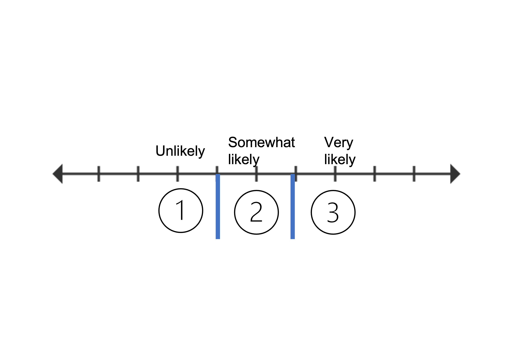

```{r xaringan-extra-styles, echo=FALSE}
library(xaringanExtra)
xaringanExtra::use_extra_styles(
  hover_code_line = TRUE,         #<<
  mute_unhighlighted_code = TRUE  #<<
)
```

```{r xaringan-themer, include=FALSE, warning=FALSE}
library(xaringanthemer)
style_solarized_dark(
  header_font_google = google_font("Work Sans"),
  header_h1_font_size = "36px",
  header_color = "black",
  text_font_google = google_font("Work Sans"),
  text_font_size = "28px",
  text_color = "black", 
  background_color = "white", 
  code_font_google = google_font("Share Tech Mono"),
  extra_css = list(
    ".remark-slide-content h2" = list(
      "margin-top" = "2em",
      "margin-bottom" = "2em"
    ),
    .big = list("font-size" = "150%"),
    .small = list("font-size" = "75%"),
    .subtle = list(opacity = "0.6"),
    ".countdown-has-style h3, .countdown-has-style h3 ~ p, .countdown-has-style h3 ~ ul" = list(
      "margin" = "0"
    ),
    ".countdown-has-style pre" = list(
      "margin-top" = "-10px"
    ),
    "p .remark-inline-code" = list(
      "background-color" = "white",
      "padding" = "2px 2px",
      "margin" = "0 -2px"
    ),
    blockquote = list("margin-left" = 0),
    "em" = list(color = "#2aa198")
  ),
)
```

```{r setup, include=FALSE}
options(htmltools.dir.version = FALSE)
knitr::opts_chunk$set(
  fig.width=12, fig.height=8, fig.retina=4,
  out.width = "90%",
  tidy.opts=list(width.cutoff=80),tidy=TRUE, 
  cache = FALSE,
  echo = TRUE,
  message = FALSE, 
  warning = FALSE,
  fig.show = TRUE,
  hiline = TRUE
)
hook_source <- knitr::knit_hooks$get('source')
knitr::knit_hooks$set(source = function(x, options) {
  x <- stringr::str_replace(x, "^[[:blank:]]?([^*].+?)[[:blank:]]*#<<[[:blank:]]*$", "*\\1")
  hook_source(x, options)
})
```

```{r echo=FALSE, message=FALSE, warning=FALSE}
library(tidyverse)
library(effects)
library(ggeffects)
library(parameters)
library(tidybayes)
library(car)
library(tidymodels)
library(modelr)
library(ggrepel)
library(GGally)
library(ggeasy)
library(xaringanExtra)
library(knitr)
library(patchwork)
library(cowplot)
library(viridis)
library(ggfortify)
library(gridExtra)
library(MASS)
```

```{r xaringan-panelset, echo=FALSE}
xaringanExtra::use_panelset()
```

## Ordinal Response Variables

- In psychology many variables have a natural ordering

  - Grades (e.g., A,BC)
  - Education level (e.g., BA, MS, Phd)
  - Competitions (e.g., 1st, 2nd, 3rd)
  - Economic Status (e.g., wealthy, poor)
---
# This is a cat, not a dog?

.pull-left[

```{r, echo=FALSE,fig.align='center', out.width="50%"}

knitr::include_graphics("Honey.JPG")
```
]

.pull-right[

1. Very likely to be a cat
2. Somewhat likely to be a cat
3. As likely to be cat or dog
4. Somewhat likely to be a dog
5. Very likely to be a dog
]

- This is a Likert scale ("Lick-ert")

---
# Cumulative link model

.pull-left[

- Theory: You have a continuous latent variable that has been categorized into bins: 

  - Latent "Honey's` catness"
]

.pull-right[
```{r, echo=FALSE, fig.align='center', out.width="100%"}

knitr::include_graphics("latent_ord.PNG")

```

]
---
## Cumulative Probabilities - Notation

- $P_k$: Probability of being category k
- $C_{pk}$: Cumulative probability of being category k or lower
- $1-C_{pk}$: Probability of being above category k

- Notes: 

  1. $C_{pk} = p_1 + p_2 + ... + p_k$
  2. $p_1 = C_{p1}, C_{pk} - C_{pk-1}(k=2,...K-1) p_k = 1-C_{pk-1}$
  
---
## Cumulative Odds and Log-odds

- Odds

$$\textrm{Odds} = \frac{\# \textrm{successes}}{\# \textrm{failures}}=
\frac{\# \textrm{successes}/n}{\# \textrm{failures}/n}=
\frac{p}{1-p}$$
- Cumulative Odds

  - *Odds* of being in at least in category k to above category k 

$$C_{pk}/1-C_{pk}$$

- Log odds (cumulative logit)

$$log(C_{pk}/1-C_{pk})$$
---
## Ordinal regression model

$$log (\frac{C_{pk}}{1-C_{pk}}) = \alpha - \beta_{j0}$$
$$\begin{array}{rcl} L_1 &=& \alpha_1-\beta_1x_1+\cdots+\beta_p X_p\\ L_2 &=& \alpha_2-\beta_1x_1+\cdots+\beta_p X_p & \\ L_{J-1} &=& \alpha_{J-1}-\beta_1x_1+\cdots+\beta_p X_p \end{array}$$

- Here we are estimating J-1 equations simultaneously

- Each equation as a different intercept $\alpha_k$ (thresholds) but a *common slope* $\beta$

- Intercepts are always ordered in size $\alpha_1$ < $\alpha_2$

---
## Ordinal regression model

$$\begin{array}{rcl} L_1 &=& \alpha_1-\beta_1x_1+\cdots+\beta_p X_p\\ L_2 &=& \alpha_2-\beta_1x_1+\cdots+\beta_p X_p& \\ L_{J-1} &=& \alpha_{J-1}-\beta_1x_1+\cdots+\beta_p X_p \end{array}$$
- Where:

  - $\alpha$ (intercepts/thresholds/cut-offs) = Log-odds of falling into or below category 

  - $\beta$ = Slope (constant between categories)

  - $-$ =  Helps with interpretation (positive $b$ higher chance of being in higher categories)

---
## Proportional odds assumption

- Assumes slope is equal between categories 

```{r, echo=FALSE, fig.align='center', out.width="50%"}

knitr::include_graphics("prop_asssump.png")

```

---
## Data: postgraduate school applications 

- Undergraduate students report how likely they were to apply to graduate school: "Unlikely", "Somewhat Likely", "Very likely"

- Got additional information: GPA, parent education (college vs. no college), type of schooling (public vs. private) 

```{r}
library(ordinal) # clm func for regression
library(MASS) # polr func for
```

```{r}
library(tidyverse)
library(emmeans)
library(ggeffects)
library(foreign) # read dta file

# load data
dat <- read.dta("https://stats.idre.ucla.edu/stat/data/ologit.dta")

```

---
## Data

```{r, echo=FALSE}
#data
knitr::kable(head(dat))
```

```{r}

dat <- dat %>%
  mutate(pared=as.factor(pared), public=as.factor(public))

# make sure ordered properly 

head(ordered(dat$apply))

```
---
## A simple model

$$\text{logit}(p(y_i \leq j)) = \theta_j - \beta_2 \text{parent_education}_i$$
```{r}
# link = probit would also be acceptable
ols1 = clm(apply ~ pared, data=dat, link = "logit")

summary(ols1)

```
---
## Interpreting output

```{r, echo=FALSE}

knitr::kable(tidy(ols1))

```

- 1 coef and 2 thresholds - What's up with that?
  - Coefficients
  - Can be interpreted similarly to GLM
      - 1-unit increase (no edu -> edu) we expect a change of 1.13 on the log-odds scale
      - Means more likely to apply to college (go to right of scale)
---
## Interpreting output

.pull-left[
- Thresholds (cut-offs)

  - Less than or equal to a certain level vs greater than that level

 - j = 1: log-odds of rating = 1 vs. 2-3
 - j = 2: log-odds of rating = 1-2 vs. 3
]

.pull-right[
```{r, echo=FALSE, fig.align='center', out.width="100%"}



```
]
---
##  Cumulative odds ratios

- Sometimes odds ratios are more meaningful

- Almost 3x more likely  to apply to college if parent went to college

```{r}

knitr::kable(model_parameters(ols1, exponentiate=TRUE))

```

---
## Probabilities

$$p(logit)=\frac{e^{logit}}{1+e^{logit}}\frac{exp(a_k - bx)}{1+exp(a_k - bx)}$$

```{r}
## view a summary of the model
ggpredictions_ols1 = ggemmeans(ols1,  terms = c("pared"))

ggpredictions_ols1 <- as.data.frame(ggpredictions_ols1)

knitr::kable(head(ggpredictions_ols1))
```
---
## Model visualizations

.pull-left[
```{r, echo=TRUE}
#Note that ggpredicts doesn't give the original labels for positio - you need to give it the names of the factor labels, which will be in the order of the original model.
ggpredictions_ols1$x = factor(ggpredictions_ols1$x)
levels(ggpredictions_ols1$x) = c("No Edu", "Edu")
colnames(ggpredictions_ols1)[c(1, 6)] = c("Ed", "Apply")
#plot

plot <- ggplot(ggpredictions_ols1, aes(x = as.factor(Apply), y = predicted)) + geom_point(aes(color = Ed), position =position_dodge(width = 0.5)) + geom_errorbar(aes(ymin = conf.low, ymax = conf.high, color = Ed), position = position_dodge(width = 0.5), width = 0.3) + theme_bw() +   scale_y_continuous(labels = scales::percent)  + labs(x = "Apply", y = "predicted probability")

```
]

.pull-right[
```{r, echo=FALSE, fig.align='center', out.width="100%"}
plot

```

]
---
## Plot ratings 

- Predicted Probability 

.pull-left[
```{r, fig.align='center', out.width="60%"}
plot<- emmeans(ols1,
        ~ apply | pared, mode = "prob") %>% # model = prob get predicted probs
  plot() 

```
]
.pull-right[

```{r, fig.align='center', out.width="100%"}
plot
```

]
---
## Testing proportional odds assumption

.pull-left[
- A few ways: 

  - Stratified binomial regressions

    - Run separate binomial logistic regressions
    
```{r}
library(modelsummary) # plot multiple regressions or tables
dat$unlikely <- ifelse(dat$apply == "unlikely", 0, 1)
dat$likely <- ifelse(dat$apply == "very likely", 1, 0)
```
]

.pull-right[

```{r, echo=FALSE}
models <- list(
  "Ordinal 1" = glm(likely~pared, data=dat, family=binomial),
  "Ordinal 2" = glm(unlikely~pared, data=dat, family=binomial))
modelsummary::modelsummary(models)

```

]

---
## Test proporitional odds assumption

.pull-left[
- `brant` test

  - Likelihood of the full ordinal logistic regression model (which makes the proportional odds assumption) to the likelihood of a reduced model that does not make this assumption
    
    - You want a ns $\chi^2$ test
]

.pull-right[
```{r}
library(gofcat)# prop odds assum
#need to fit different model

brant.test(ols1)

```
]
---
## Test proporitional odds assumption

if test is violated, there are a few options: 

- Baseline logistic model

  - Use lowest level/rank as reference
  
- Adjacent category model

- Multinomial regression

---
## Test proporitional odds assumption

- Partial proportion odds model

```{r}

ols_nom = clm(apply ~ pared + public + gpa,nominal = ~ public, data=dat, link = "logit")

knitr::kable(tidy(ols_nom))

```

---
## Test ordinal assumptions

.pull-left[

- `sure` package: surrogate residuals
  
```{r, echo=TRUE, eval=FALSE, fig.align='center', out.width="70%"}

library(sure)
library(cowplot)

# for reproducibility
set.seed(1225) 

surrogate <- gridExtra::grid.arrange( 
  autoplot.clm(ols1, nsim = 100, what = "qq"),
  autoplot.clm(ols1, nsim = 100, what = "fitted", alpha = 0.5),
  autoplot.clm(ols1, nsim = 100, what = "covariate", x = dat$pared,
           xlab = "Education"),
  ncol = 2
)
```
]

.pull-right[

```{r, echo=FALSE, fig.align='center', out.width="100%" }
library(sure)
library(cowplot)

# for reproducibility
set.seed(1225) 

surrogate <- gridExtra::grid.arrange( 
  autoplot.clm(ols1, nsim = 100, what = "qq"),
  autoplot.clm(ols1, nsim = 100, what = "fitted", alpha = 0.5),
  autoplot.clm(ols1, nsim = 100, what = "covariate", x = dat$pared,
           xlab = "Education"),
  ncol = 2
)

```
]
---
## Model 2: Add Public School + GPA

- Let's run this model: 

```{r,}
ols2 = clm(apply ~ pared + public + gpa, data=dat)
```

---
## Interpret the Coefficents

```{r}
knitr::kable(tidy(ols2))
```

---
## Visualization: stacked area plots (continuous predictors)

.pull-left[
```{r,fig.align='center', out.width="100%"}
library(effects) # stacked plots

stack <- plot(effect("gpa", ols2), style="stacked")
```
]

.pull-right[
```{r, echo=FALSE, fig.align='center', out.width="100%"}
stack 
```
]
---
## Visualization: stacked area plots (Categorical predictors)

.pull-left[
```{r,fig.align='center', out.width="100%"}
library(effects) # stacked plots

stack <- plot(effect("public", ols2), style="stacked")
```
]

.pull-right[
```{r, echo=FALSE, fig.align='center', out.width="100%"}
stack 
```
]
---
## Model 3: Add public school + GPA interaction

```{r}

ols3 = clm(apply ~ public + pared*gpa, data=dat)

```

---
## Model 3: Add public school + GPA interaction

```{r}

knitr::kable(tidy(ols3))

```

---
## Visualization: Interactions

.pull-left[
```{r,fig.align='center', out.width="100%"}

interact <- ggemmeans(ols2, terms= c("gpa", "pared"))
```

]

.pull-right[

```{r, echo=FALSE, fig.align='center', out.width="100%"}
interact %>% plot()
```
]
---
## Testing Significnce

- Likelihood ratio tests (LRT)

  - Model comparisons
  
    - Main Effects vs. Interaction
    
```{r}
#main effects model vs. interaction
ols_test <- anova(ols2, ols3)

knitr::kable(ols_test)

```

---

```{r}
#main effects model vs. interaction
# USE TYPE III IF INTERACTIONS ARE IMPORTANT
ols_test <- car::Anova(ols3, type="III")

knitr::kable(ols_test)

```
---
## Pairwise comparisons

- Main effects

```{r}
# pairwise contrasts
emmeans(ols3, list(pairwise ~ pared, pairwise ~ public))

```
---
## Simple effects

```{r}
# pairwise contrasts
emmeans(ols3,pairwise ~ pared*gpa)
```

- What is wrong with this?
---
# Simple slopes

```{r}

emtrends(ols3,pairwise ~ pared, var="gpa")

```
---
## Model fit

- Pseudo-$R^2$

 1 - $LL_{mod} /LL_{null}$

```{r}
library(easystats)

#model goodness
r2_mcfadden(ols2)

```
---
## Sample write-up

>  An ordered logit model was estimated to investigate factors (parent education, GPA, and public schooling) that influence whether undergraduates apply to  graduate school (“unlikely,” “somewhat likely,” “very likely”). Parent education predicted the likelihood of applyng to graduate school, *b* = 1.04, *z* = 3.942, *p* < .001, OR = 2.82.Students with parents that went to college were 4% more likely to apply to graduate school.  GPA was also a significant predictor, *b* = 0.615, *z* = 2.363, *p* < .001, OR = 1.84. Each point increase on GPA was associated with a 84% increase in the likelihood of applying to college. The overall  McFadden’s pseudo-R2 = .042. 
---
## Extensions

- Ordinal Regression in `brms`

  - Bayesian implementation (tomororw)

  - Familiar output
  
- Figure one liner 

```{r, eval=FALSE}

ols2_brm = brm(ordered(apply) ~  gpa, data=dat, family = cumulative, cores = 4,chains = 4, backend = "cmdstanr")

```

---
## Multilevel Ordinal Regressions

- Repeated measures designs

- Clustered/nested designs

```{r, eval=FALSE}

ols2_clmm = clmm()

```

```{r, include = FALSE, eval=FALSE,fig.align='center', out.width="80%"}

library(ggtext)

ols2_brm <-  readRDS("~/Documents/Ordinal_Regression/data/ord_model.rds")

my_labels <- c("unlikely",
               "somewhat likely", 
               "very likely")

df_fitted <- dat %>%
  data_grid(gpa) %>%
  add_epred_draws(ols2_brm) %>%
  mutate(rating = factor(as.numeric(.category)))

# This is a crucial step if you want to be able to plot lines
df_fitted <- df_fitted %>%
  group_by(.draw, .category) %>%
  mutate(indices = cur_group_id()) %>%
  ungroup()

# Plotting the fitted draws
p <- df_fitted %>%
  ggplot(aes(x = gpa, 
             y = .epred, 
             color = .category,
             fill=.category))  +
  geom_line(alpha = 0.2)
p +
  labs(title = "GPA and Graduate School",
       subtitle = "Ordinal Regression",
       x = "GPA",
       y = NULL)
        # You'll have to add this element_textbox_simple call to make the formatting work + 
  geom_text_repel(data=df_fitted %>%
                    distinct(rating, .keep_all = TRUE), aes(label = rating), 
                  direction = "y", 
                  hjust = 0, 
                  segment.size = 0.2,
                  # Move the labels to the right
                  nudge_x = 0.4,
                  na.rm = TRUE,
                  # Expand limits so that the label doesn't get stuck
                  xlim = c(1, 4),
                  # Use the theme_ipsum_ps() font family
                  
                  # Adjust size as needed!
                  size = 3.5) 

data = df_fitted %>%
      # Keep just one of each
  distinct(.category, .keep_all = TRUE)

```
