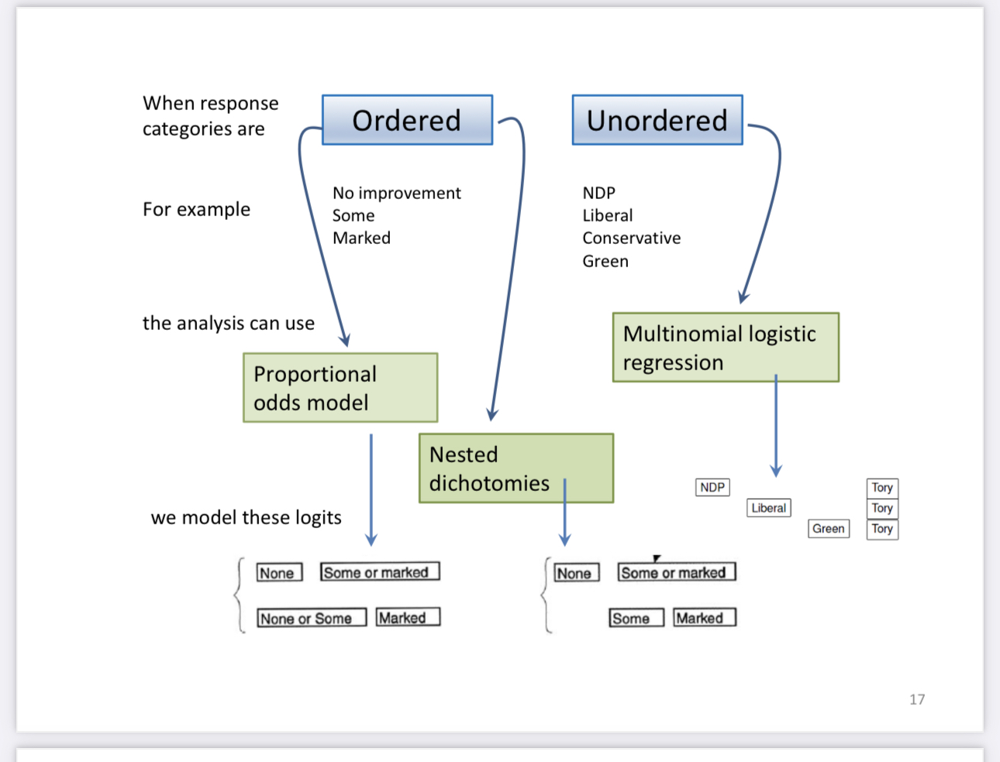
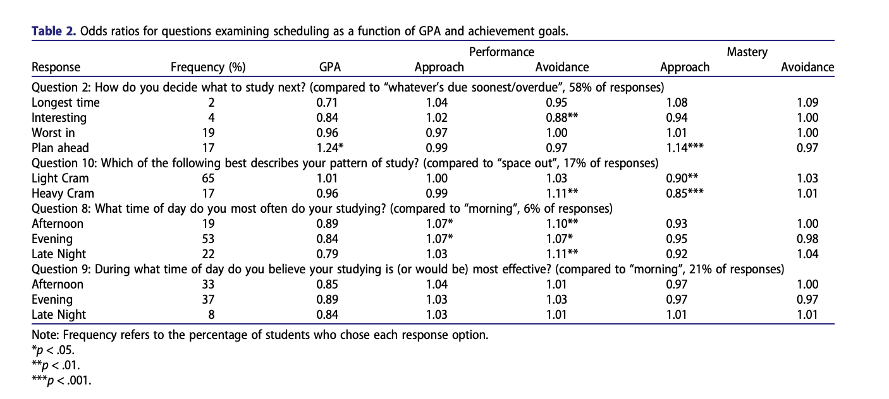

```{r echo=FALSE, message=FALSE, warning=FALSE}
library(tidyverse)
library(emmeans)
library(effects)
library(ggeffects)
library(parameters)
library(tidybayes)
library(car)
library(tidymodels)
library(modelr)
library(ggrepel)
library(GGally)
library(ggeasy)
library(xaringanExtra)
library(knitr)
library(patchwork)
library(cowplot)
library(viridis)
library(ggfortify)
library(gridExtra)
library(MASS)
```

```{r xaringan-themer, include=FALSE, warning=FALSE}
library(xaringanthemer)
style_solarized_dark(
  header_font_google = google_font("Work Sans"),
  header_h1_font_size = "36px",
  header_color = "black",
  text_font_google = google_font("Work Sans"),
  text_font_size = "25px",
  text_color = "black", 
  background_color = "white", 
  code_font_google = google_font("Share Tech Mono"),
  extra_css = list(
    ".remark-slide-content h2" = list(
      "margin-top" = "2em",
      "margin-bottom" = "2em"
    ),
    .big = list("font-size" = "150%"),
    .small = list("font-size" = "75%"),
    .subtle = list(opacity = "0.6"),
    ".countdown-has-style h3, .countdown-has-style h3 ~ p, .countdown-has-style h3 ~ ul" = list(
      "margin" = "0"
    ),
    ".countdown-has-style pre" = list(
      "margin-top" = "-10px"
    ),
    "p .remark-inline-code" = list(
      "background-color" = "white",
      "padding" = "2px 2px",
      "margin" = "0 -2px"
    ),
    blockquote = list("margin-left" = 0),
    "em" = list(color = "#2aa198")
  ),
)
```

```{r setup, include=FALSE}
options(htmltools.dir.version = FALSE)
knitr::opts_chunk$set(fig.retina=4,
  out.width = "90%",
  tidy.opts=list(width.cutoff=80),tidy=TRUE, 
  cache = FALSE,
  echo = TRUE,
  message = FALSE, 
  warning = FALSE,
  fig.show = TRUE,
  hiline = TRUE
)
hook_source <- knitr::knit_hooks$get('source')
knitr::knit_hooks$set(source = function(x, options) {
  x <- stringr::str_replace(x, "^[[:blank:]]?([^*].+?)[[:blank:]]*#<<[[:blank:]]*$", "*\\1")
  hook_source(x, options)
})
```
## Outline

- Introduce multinomial logistic regression

- Interpret model coefficients

- Inference for a coefficient βjk

---
```{r, echo=FALSE, fig.align="center", out.width="80%"}



```
---

## Multinomial Logistic Regression

- In ordinal regression: 

$$\begin{array}{rcl} L_1 &=& \alpha_1-\beta_1x_1+\cdots+\beta_p X_p\\ L_2 &=& \alpha_2-\beta_1x_1+\cdots+\beta_p X_p & \\ L_{J-1} &=& \alpha_{J-1}-\beta_1x_1+\cdots+\beta_p X_p \end{array}$$

- In the multinomial logistic model:

$$\begin{array}{rcl} L_1 &=& \alpha_1+\beta_1x_1+\cdots+\beta_p X_p\\ L_2 &=& \alpha_2+\beta_2x_1+\cdots+\beta_p X_p & \\ L_{J-1} &=& \alpha_{J-1}+\beta_jx_1+\cdots+\beta_p X_p \end{array}$$
---
## Multinomial logistic regression

- Choose a baseline category. Let's choose $y=0$.  Then, 

$$P(y_i = 0|x_i) = P_{i0} and P(y_i = 1|x_i) = P_{i1}$$
.eq[
$$\log\bigg(\frac{p_{i1}}{p_{i0}}\bigg) = \beta_{0k} + \beta_{1k} x_i$$
]

- Slope, $\beta_1$: when x increases by one unit, the odds of Y = 1 vs. baseline is expected to multiply by a factor or $exp(\beta)$

- Intercept, $\beta_0$: when x = 0 the odds of Y = 1 is expeted to be $exp(\beta)$
---
## Multinomial Logistic Regression 

- Which of the following best describes your pattern of study?

  - Light cram
  - Heavy cram
  - Space out

- Let "Space out" be the baseline category. Then 

$$\log\bigg(\frac{\pi_{light }}{\pi_{space}}\bigg) = \beta_{0B} + \beta_{1B}x_i \\[10pt]
\log\bigg(\frac{\pi_{heavy}}{\pi_{space}}\bigg) = \beta_{0C} + \beta_{1C} x_i$$
---
## Summary

- Multinomial logistic regression models the probabilities of j response categories (j-1)

  - Typically these compare each of the first m-1 categories to the last (reference) category
  
    - 1 vs. m, 2 vs.m, 3 vs. m
    
- Logits for any pair of categories can be calculated from the m-1 fitted ones

---
## NHANES Data

- [National Health and Nutrition Examination Survey](https://www.cdc.gov/nchs/nhanes/index.htm) is conducted by the National Center for Health Statistics (NCHS) 

- The goal is to *"assess the health and nutritional status of adults and children in the United States"*

- This survey includes an interview and a physical examination

---

## NHANES Data

- We will use the data from the <font class="vocab">`NHANES`</font> R package

- Contains 75 variables for the 2009 - 2010 and 2011 - 2012 sample years

- The data in this package is modified for educational purposes and should **not** be used for research

- Original data can be obtained from the [NCHS website](https://www.cdc.gov/nchs/data_access/index.htm) for research purposes

- Type <font class="vocab">`?NHANES`</font> in console to see list of variables and definitions

---
## Health Rating vs. Age & Physical Activity

- **Question**: Can we use a person's age and whether they do regular physical activity to predict their self-reported health rating?

- We will analyze the following variables: 

  + <font class="vocab">`HealthGen`: </font>Self-reported rating of participant's health in general.  Excellent, Vgood, Good, Fair, or Poor.
  
    + <font class="vocab">`Age`: </font>Age at time of screening (in years). Participants 80 or older were recorded as 80.
    
  + <font class="vocab">`PhysActive`: </font>Participant does moderate to vigorous-intensity sports, fitness or recreational activities
---
## The data

```{r}
library(NHANES)
nhanes_adult <- NHANES %>%
  #only use ages 18+
  filter(Age >= 18) %>%
  #select 4 vars from the full dataset
  dplyr::select(HealthGen, Education, Age, PhysActive) %>%
  # get rid of nas
  drop_na() %>%
  mutate(obs_num = 1:n())
```

```{r}
glimpse(nhanes_adult)
```

---
## Missingness

```{r, eval=FALSE}
library(skimr)
library(mice)

skimr::skim(nhanes_adult)

#you can imputate missing categorical data
nhanes_impu=complete(mice(nhanes_adult, m=5))

```

---
## Exploratory data analysis

```{r echo = F, fig.align="center", out.width = "50%"}
p1 <- ggplot(data = nhanes_adult, aes(x = Age)) + 
  geom_histogram() +
  labs(title = "Distribution of Age")
p2 <- ggplot(data = nhanes_adult, aes(x = PhysActive)) + 
  geom_bar() +
  labs(title = "Moderate or vigorous sport or exercise")
p3 <- ggplot(data = nhanes_adult, aes(x = HealthGen)) + 
  geom_bar() +
  labs(title = "Self-reported rating of overall health")
p3 + (p1 / p2)
```

---
## Exploratory data analysis

```{r echo = F,fig.align="center",out.width="80%", fig.width=14, fig.height=8}
p1 <- ggplot(data = nhanes_adult, aes(x = HealthGen, y = Age)) +
  geom_boxplot(fill = "steelblue") + 
  labs(title = "Age vs. Health Rating") +
  coord_flip()
p2 <- ggplot(data = nhanes_adult, aes(x = PhysActive, fill = HealthGen)) +
  geom_bar(position = "fill") +
  labs(y = "Proportion", 
       title = "Physical Activity vs. Health Rating") 
p1 + p2
```

---

## Multinomial Model in R

- Use the <font class="vocab">`multinom()`</font> function in the `nnet` package 

```{r, echo = T, results = "hide"}
library(nnet)# multinom 
library(emmeans) # marginal means
library(ggeffects) # visualization

health_m <- multinom(HealthGen ~ PhysActive + Age, 
                     data = nhanes_adult)


summary(health_m)

```

- Put `results = "hide"` in the code chunk header to suppress convergence output 

---
## Output results

```{r echo = T, eval = T}

model_parameters(health_m, exponentiate = FALSE)%>%  filter(Response=="Fair") %>%
  kable(digits = 3, format = "markdown")
```
---
## Output results

```{r echo = T, eval = T}
model_parameters(health_m, exponentiate = TRUE) %>% filter(Response=="Fair") %>% kable(digits = 3, format = "markdown")

```
---
## Fair vs. Excellent Health

The baseline category for the model is .vocab[`Excellent`]. 

--

The model equation for the log-odds a person rates themselves as having "Fair" health vs. "Excellent" is

$$\log\Big(\frac{\hat{\pi}_{Fair}}{\hat{\pi}_{Excellent}}\Big) = .915  + 0.003 ~ \text{age} - 1.66 ~ \text{PhysActive}$$
---
## Interpretations

.eq[
$$\log\Big(\frac{\hat{\pi}_{Fair}}{\hat{\pi}_{Excellent}}\Big) = .915  + \color{Red} {0.003} ~ \text{age} - 1.66 ~ \text{PhysActive}$$
]

- For each additional year in age, the odds a person rates themselves as having fair health versus excellent health are expected to multiply by `r round(exp(0.003), 3)` (exp(0.003)), holding physical activity constant. 

  - As Age ⬆️, more likely to report Fair vs. Excellent health

---
## Interpretations

.eq[
$$\log\Big(\frac{\hat{\pi}_{Fair}}{\hat{\pi}_{Excellent}}\Big) = .915  + 0.003 ~ \text{age} \color{Red}{- 1.66} ~ \text{PhysActive}$$
]

- The odds a person who does physical activity will rate themselves as having fair health versus excellent health are  expected to be `r round(exp(-1.66	),3)` `(exp(-1.66	))` times the odds for a person who doesn't do physical activity, holding age constant.

  - A person who does physical activity is more likely to rate themselves in Excellent vs. Fair health 

---
## Interpretations

.eq[
$$\log\Big(\frac{\hat{\pi}_{Fair}}{\hat{\pi}_{Excellent}}\Big) = \color{Red}{.915}  + 0.003 ~ \text{age} - 1.66 ~ \text{PhysActive}$$
]

- The odds a 0 year old person who doesn't do physical activity rates themselves as having fair health vs. excellent health are `r round(exp(.915),3)` ` (exp(.915))`. 
--

`r emo::ji("warning")` **Need to mean-center age for the intercept to have a meaningful interpretation!**

---
## Good vs. Excellent health

```{r echo = T, eval = T}
model_parameters(health_m, exponentiate = FALSE)%>%  filter(Response=="Good") %>%
  kable(digits = 3, format = "markdown")


```
---

```{r}
model_parameters(health_m, exponentiate = TRUE) %>% 
  filter(Response=="Good") %>%
  kable(digits = 3, format = "markdown")
```

---
## Good vs. Excellent health

The baseline category for the model is .vocab[`Excellent`]. 

--

The model equation for the log-odds a person rates themselves as having "Good" health vs. "Excellent" is

$$\log\Big(\frac{\hat{\pi}_{Good}}{\hat{\pi}_{Excellent}}\Big) = 1.99  - 0.003	 ~ \text{age} - 1.011 ~ \text{PhysActive}$$
---
## Interpretations

.eq[
$$\log\Big(\frac{\hat{\pi}_{Good}}{\hat{\pi}_{Excellent}}\Big) = 1.99 \color{Red}{- 0.003}	 ~ \text{age} - 1.011 ~ \text{PhysActive}$$
]

- For each additional year in age, the odds a person rates themselves as having "Good" health versus "Excellent" health are expected to multiply by `r round(exp(0.003), 3)` (exp(0.02)), holding physical activity constant

  - As Age ⬆️, higher probability to report good health vs. excellent health

---
## Interpretations

.eq[
$$\log\Big(\frac{\hat{\pi}_{Good}}{\hat{\pi}_{Excellent}}\Big) = {1.99}  - 0.003	 ~ \text{age} \color{Red}{- 1.011} ~ \text{PhysActive}$$
]

- The odds a person who does physical activity will rate themselves as having "Good" health versus "Excellent" health are  expected to be `r round(exp(-1.01),3)` `(exp(-1.01))` times the odds for a person who doesn't do physical activity, holding age constant

  - A person who does physical activity ⬆️ rate themselves in Excellent vs. good health 

---
## Interpretations

.eq[
$$\log\Big(\frac{\hat{\pi}_{Good}}{\hat{\pi}_{Excellent}}\Big) = \color{Red}{1.99}  - 0.003	 ~ \text{age} - 1.011 ~ \text{PhysActive}$$
]

- The odds a 0 year old person who doesn't do physical activity rates themselves as having poor health vs. excellent health are `r round(exp(1.99),3)` `(exp(1.99))`. 


```{r}
nhanes_adult %>%
  mutate(age_center=datawizard::center(Age))
```


- Those reporting no physical activity are more likely to report Good vs. Excellent health

--

`r emo::ji("warning")` **Need to mean-center age for the intercept to have a meaningful interpretation!**
---
## Change baseline

<br>
<br>

```{r, eval=FALSE}

nhanes_adult %>%
  mutate(HealthGen = relevel(as.factor(HealthGen), ref= "Poor")) %>% dplyr::select(HealthGen)


```

---
## Hypothesis test for $\beta_{jk}$

The test of significance for the coefficient $\beta_{jk}$ is 

.alert[

**Hypotheses**: $H_0: \beta_{jk} = 0 \hspace{2mm} \text{ vs } \hspace{2mm} H_a: \beta_{jk} \neq 0$

**Test Statistic**: $$z = \frac{\hat{\beta}_{jk} - 0}{SE(\hat{\beta_{jk}})}$$

**P-value**: $P(|Z| > |z|)$, 

where $Z \sim N(0, 1)$, the Standard Normal distribution
]

---

## NHANES results

- `emmeans` approach 

```{r}
multi_an <- emmeans(health_m, ~ PhysActive|HealthGen)

# uses baseline as contrast of interest
# can change this to get other baselines
# use trt.vs.ctrl" #ref = newbaseline
coefs = contrast(regrid(multi_an, "log"),"trt.vs.ctrl1",  by="PhysActive")

update(coefs, by = "contrast") %>%
  kable(format = "markdown", digits = 3)
```
---
## NHANES results 

```{r}

# get difference between yes-no and fair-excellent
contrast(coefs, "revpairwise", by = "contrast") %>%
  kable(format = "markdown", digits = 3)


```
---
## Calculating probabilities

For categories $2,\ldots,K$, the probability that the $i^{th}$ observation is in the $j^{th}$ category is:

$$\hat{\pi}_{ij} = \frac{\exp\{\hat{\beta}_{0j} + \hat{\beta}_{1j}x_{i1} + \dots + \hat{\beta}_{pj}x_{ip}\}}{1 + \sum\limits_{k=2}^K \exp\{\hat{\beta}_{0k} + \hat{\beta}_{1k}x_{i1} + \dots \hat{\beta}_{pk}x_{ip}\}}$$
<br> 

For the baseline category, $k=1$, we calculate the probability $\hat{\pi}_{i1}$ as
$$\hat{\pi}_{i1} = 1- \sum\limits_{k=2}^K \hat{\pi}_{ik}$$

---
## NHANES: Predicted probabilities: `PhysActive` 
 
 .midi[
```{r echo = T}
#calculate predicted probabilities
ggemmeans(health_m, terms=c("PhysActive")) %>%
  kable(format = "markdown", digits = 3)
```
]

---
## Plot predicted probabilities: `PhysActive`

.pull-left[
```{r}
pred_probs_plot <- ggemmeans(health_m, terms=c("PhysActive")) %>%   ggplot(., aes(x = x, y = predicted, fill = response.level)) + 
  geom_bar(stat = "identity" ) +
    geom_text(aes(label = round(predicted, 3)), color="white", position = position_fill(vjust = 0.5),size=5)  + 
  easy_add_legend_title("Response") + 
  labs(x="Physical Health", "Predicted Probablity") + 
  theme(text = element_text(size = 30)) +  
  scale_fill_viridis(discrete = TRUE)
```

]

.pull-right[
```{r, echo=FALSE, fig.aligh = "center", out.width="100%"}

pred_probs_plot

```

]


---
# Plot predicted probabilities: `Age`

```{r, echo=FALSE, fig.align='center', out.width="50%"}

stack <- plot(effect("Age", health_m), style="stacked")

stack
```

---
class: middle, center

## Model selection 

---
## Comparing nested models 

- Suppose there are two models: 
    - Reduced Model includes predictors $x_1, \ldots, x_q$
    - Full Model includes predictors $x_1, \ldots, x_q, x_{q+1}, \ldots, x_p$

- We want to test the hypotheses
$$\begin{aligned}&H_0: \beta_{q+1} = \dots = \beta_p = 0 \\
& H_a: \text{ at least 1 }\beta_j \text{ is not} 0\end{aligned}$$

- To do so, we will use the .vocab[Drop-in-Deviance test] (very similar to logistic regression) 

---
## Add `Education` to the model? 

- We consider adding the participants' `Education` level to the model

    - Education takes values `8thGrade`, `9-11thGrade`, `HighSchool`, `SomeCollege`, and `CollegeGrad`

- Models we're testing: 
    - Reduced Model: `Age`, `PhysActive`
    - Full Model: `Age`, `PhysActive`, `Education`
    
.alert[
$$\begin{align}&H_0: \beta_{9-11thGrade} = \beta_{HighSchool} = \beta_{SomeCollege} = \beta_{CollegeGrad} = 0\\
&H_a: \text{ at least one }\beta_j \text{ is not equal to }0\end{align}$$
]

---

## Add `Education` to the model? 

.alert[
$$\begin{align}&H_0: \beta_{9-11thGrade} = \beta_{HighSchool} = \beta_{SomeCollege} = \beta_{CollegeGrad} = 0\\
&H_a: \text{ at least one }\beta_j \text{ is not equal to }0\end{align}$$
]

```{r echo = F}
nhanes_adult <- nhanes_adult %>%
  drop_na()
```


```{r echo = T, eval = F}
model_red <- multinom(HealthGen ~ Age + PhysActive, 
               data = nhanes_adult)
model_full <- multinom(HealthGen ~ Age + PhysActive + 
                         Education, 
               data = nhanes_adult)
```

---
## Add `Education` to the model? 

```{r results = "hide"}
model_red <- multinom(HealthGen ~ Age + PhysActive, 
               data = nhanes_adult)
model_full <- multinom(HealthGen ~ Age + PhysActive + Education, 
               data = nhanes_adult)
```


```{r echo = T}
anova(model_red, model_full, test = "Chisq") %>%
  kable(format = "markdown")
```

--

At least one coefficient associated with `Education` is non-zero. Therefore, we will include `Education` in the model.

---
## Full model 

```{r}

car::Anova(model_full, type="II") %>%
  kable(format = "markdown", digits = 3)

```
---
## Model with `Education`

.small[
```{r echo = F}
model_parameters(model_full, conf.int = T) %>%
  kable(format = "markdown", digits = 3)
```
]
---
## Emmeans

- Use `emmeans` to extract log odds coefs for compairsons of interest

```{r}

multi_an <- emmeans(model_full, ~ Education|HealthGen)

coefs = contrast(regrid(multi_an, "log"),"trt.vs.ctrl1", by="Education")

update(coefs, by = "contrast") %>%
  kable(format = "markdown", digits = 3)

```
---
```{r}
contrast(coefs, "revpairwise", by = "contrast") %>%
  kable(format = "markdown", digits = 3)

```

---
## Predicted Probabilities: `Education`

```{r}
plot_edu <- ggemmeans(model_full, terms=c("Education")) %>%
  ggplot(aes(x = x, y = predicted, fill = response.level))  +  
  geom_bar(stat = "identity" ) + 
   geom_text(aes(label = round(predicted, 3)), color="white", position = position_fill(vjust = 0.5),size=5) + 
  easy_add_legend_title("Response") + 
  labs(x="Education", "Predicted Probablity") + 
  scale_fill_viridis(discrete = TRUE)


```
---
```{r, echo=FALSE, fig.align='center', out.width="50%", fig.retina=4}

plot_edu

```

---
class: middle, center

## Checking conditions

---
## Assumptions for multinomial logistic regression

We want to check the following assumptions for the multinomial logistic regression model: 

1. .vocab[Linearity]: Is there a linear relationship between the log-odds and the predictor variables?

---
## Assumptions for multinomial logistic regression

- Fit sep logistic regressions to check for linearity, outliers, and multicolinearity

```{r}

nhanes_adult <- nhanes_adult %>%
  mutate(Excellent = factor(if_else(HealthGen == "Excellent", "1", "0")), 
         Vgood = factor(if_else(HealthGen == "Vgood", "1", "0")), 
         Good = factor(if_else(HealthGen == "Good", "1", "0")), 
         Fair = factor(if_else(HealthGen == "Fair", "1", "0")), 
         Poor = factor(if_else(HealthGen == "Poor", "1", "0"))
  )

```

---
## Empirical logit

The .vocab[empirical logit] is the log of the observed odds

.eq[
**Empirical logit**

$$\text{logit}(\hat{p}) = \log\Big(\frac{\hat{p}+0.5}{1 - \hat{p}+0.5}\Big) = \log\Big(\frac{\# \text{Yes}}{\# \text{No}}\Big)$$ 
]
---
## Calculating empirical logit (quantitative predictor)

1. Divide the range of the predictor into intervals with approximately equal number of cases

  - If you have enough observations, use 5 - 10 intervals
  
2. Calculate the mean value of the predictor in each interval.

3. Compute the empirical logit for each interval.

--

Then, we can create a plot of the empirical logit versus the mean value of the predictor in each interval.

---
## Empirical logit plot in R (quantitative predictor)


.pull-left[
```{r echo = T, eval=F, out.width="100%"}
library(Stat2Data)

emplogitplot1(Excellent ~ Age, data = nhanes_adult, ngroups = 5, main = "Excellent vs. Age")

```
]

.pull-right[

```{r echo = F, out.width="100%"}
library(Stat2Data)
emplogitplot1(Excellent ~ Age, data = nhanes_adult, ngroups = 5, main = "Excellent vs. Age")
```
]

---
## Model fit

- Mcfadden's $R^2$

- Convert to cohen's *d*

$$ d = \frac{log(OR)*\sqrt(3)}{{\pi}}$$
  - Recommended by a reviewer once
  
```{r, eval=F}

oddsratio_to_d()

```

---
## Write-up

- Report full model results
  - $\chi^2$ test
    - Age, $\chi^2 (4)$ = 19.30, *p* < .05
    - PhysActive, $\chi^2 (4)$ = 242.63, *p* < .05 
    - Education, $\chi^2 (16)$ = 489.13, *p* < .05 
    
- Model fit: $R^2$

---
## Write-up

- Significant differences between all levels of self-reported health and variables of interest
  
  - Table with included ORs (see next slide for example)
  
  - Figure showing predicted probabilities

---
## OR table (Geller et al., 2017)

```{r, echo=FALSE, fig.align="center", out.width="100%"}



```

---
# Advanced Applications

- Multilevel multinomial models

  - brms
  - `mclogit` https://cran.r-project.org/web/packages/mclogit/mclogit.pdf
  
```{r, eval=FALSE}

#takes long time to run use cmdstanr to speed up models
health_m <- brm(HealthGen ~ PhysActive + Age, family=categorical, cores = 4, chains = 4, backend = "cmdstanr", 
                     data = nhanes_adult)

```


