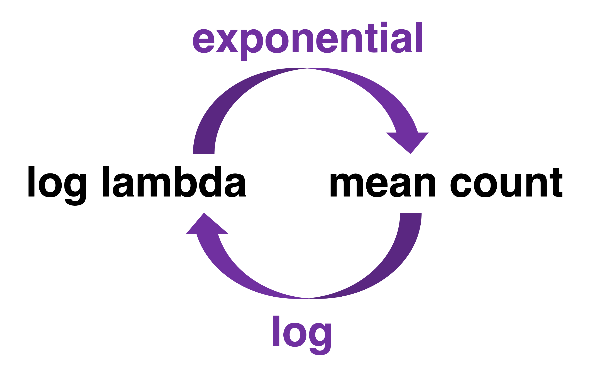

```{r xaringan-extra-styles, echo=FALSE}
library(xaringanExtra)
xaringanExtra::use_extra_styles(
  hover_code_line = TRUE,         #<<
  mute_unhighlighted_code = TRUE  #<<
)
```

```{r setup, include = F}
knitr::opts_chunk$set(warning = FALSE, 
                      message = FALSE, 
                      fig.width = 8,
                      fig.asp = 0.618, 
                      fig.retina = 3, 
                      dpt = 300, 
                      out.width = "70%",
                      fig.align = "center")
ggplot2::theme_set(ggplot2::theme_bw(base_size = 20))
colors <- tibble::tibble(green = "#B5BA72")
```

```{r echo=FALSE, message=FALSE, warning=FALSE}
library(tidyverse)
library(tidymodels)
library(GGally)
library(easystats)
library(interactions)
library(performance)
library(kableExtra)
library(ggeffects)
library(lme4)
library(emmeans)
library(broom.mixed)
library(DHARMa)
library(xaringanExtra)
library(knitr)
library(patchwork)
library(viridis)
library(ggfortify)
library(gridExtra)
```


```{r, echo=F, out.width="100%", fig.align='center'}

knitr::include_graphics("count.jpeg")


```
---
## Poisson distribution

Let $Y$ be the number of events in a given unit of time or space. Then $Y$ can be modeled using a .vocab[Poisson distribution]

$$P(Y=y) = \frac{e^{-\lambda}\lambda^y}{y!} \hspace{10mm} y=0,1,2,\ldots, \infty$$
--
.vocab[Features]

- $E(Y) = Var(Y) = \lambda$ (*just the mean number of events*)
- The distribution is typically skewed right, particularly if $\lambda$ is small
- The distribution becomes more symmetric as $\lambda$ increases
  - If $\lambda$ is sufficiently large, it can be approximated using a normal distribution
  
---

```{r echo = F, out.width="50%"}
set.seed(2000)
sim1 <- rpois(100000,1)
sim2 <- rpois(100000,5)
sim3 <- rpois(100000,50)
pois_sim <- tibble (
  sim1 = sim1, 
  sim2 = sim2, 
  sim3 = sim3
)
p1 <- ggplot(data = pois_sim, aes(x = sim1)) +
  geom_histogram() +
  labs(x = "", title = "lambda:1")
p2 <- ggplot(data = pois_sim, aes(x = sim2)) +
  geom_histogram() +
  labs(x = "", title = "lambda:5")
p3 <- ggplot(data = pois_sim, aes(x = sim3)) +
  geom_histogram() +
  labs(x = "", title = "lambda:50")
p1 + p2 + p3 
```

```{r echo = F}
sum1 <- c(mean(sim1), var(sim1))
sum2 <- c(mean(sim2), var(sim2))
sum3 <- c(mean(sim3), var(sim3))
data <- rbind(sum1,sum2,sum3)
rownames(data) <- c("lambda = 1", "lambda = 5","lambda = 50")
colnames(data) <- c("Mean", "Variance")
kable(data,format="html")
```
---
## Examples 

The annual number of earthquakes registering at least 2.5 on the Richter Scale and having an epicenter within 40 miles of downtown Memphis follows a Poisson distribution with mean 6.5. **What is the probability there will be 3 or fewer such earthquakes next year?**

--
$$P(Y<=y) = \frac{e^{-6.5}10^0} {0!}+
\frac{e^{-6.5}10^1} {1!} + 
 \frac{e^{-6.5}10^2} {2!} + 
  \frac{e^{-6.5}10^3} {3!}$$
```{r}
a=(exp(-6.5) * 6.5^0) / factorial(0)
b=(exp(-6.5) * 6.5^1) / factorial(1)
c=(exp(-6.5) * 6.5^2) / factorial(2)
d=(exp(-6.5) * 6.5^3) / factorial(3)

ppois(3, 6.5)
```

---
## Examples 

- Exact count

  - Let's say you read, on average, 10 pages an hour. **What is the probability you will read 8 pages in an hour?**

--

$$P(Y=y)= \frac{e^{-10}10^8} {8*7*6*5*4*3*2*1}$$
```{r}

prob <- (exp(-10) * 10^8) / factorial(8)

dpois(x=8, lambda=10)

prob

```
---

class: middle, inverse

## Poisson regression

---
## Preferential viewing task

- The data: viewing behavior to emotional faces

```{r, fig.align='center', echo=FALSE}

include_graphics("faces.png")

```
---
## Preferential viewing task

**Response**: 

  - Number of fixations to each face

- **Predictors**: 

  - `Emotion`: Anger vs. Happy
  - `Group`: Control vs. Stuttering

---

## The data 

```{r}
hh_data <- read_csv("https://raw.githubusercontent.com/jgeller112/psy504-advanced-stats/main/slides/Poisson/data/tobii_aoi_study1.csv")
```

```{r}
library(tidyverse) 
library(performance) # check model
library(lme4) # glmer and glmer.nb
library(emmeans) # marginal means and contrasts
library(ggeffects) # viz
library(broom.mixed) #lme4 tidy
#library(MASS) # glm.nb

```

---

## The data
```{r, echo=FALSE}
hh_data <- hh_data %>% dplyr::select(ID, Number_of_fixations, emotion, Group) %>%
  filter(emotion=="Anger"| emotion=="Happy")

head(hh_data)
  
```
---

## Response variable

.pull-left[
```{r, echo = F, out.width = "100%"}
ggplot(data = hh_data, aes(x = Number_of_fixations)) +
  geom_histogram() + 
  labs(title = "Total number of fixations")
```
]

<br>

<br>

.pull-left[
```{r echo = F}
hh_data %>% ungroup() %>%
  summarise(mean = mean(Number_of_fixations), var = var(Number_of_fixations), ratio=mean/var) %>%
  kable(digits = 3)
```
]
---
## Why the least-squares model doesn't work

The goal is to model $\lambda$, the expected number of fixations on faces, as a function of the predictors (covariates)

--

We might be tempted to try a linear model $$\lambda_i = \beta_0 + \beta_1x_{i1} + \beta_2x_{i2} + \dots + \beta_px_{ip}$$

--
This model won't work because...

- It could produce negative values of $\lambda$ for certain values of the predictors 

- The equal variance assumption required to conduct inference for linear regression is violated. 

---
## Poisson regression model 

If $Y_i \sim Poisson$ with $\lambda = \lambda_i$ for the given values $x_{i1}, \ldots, x_{ip}$, then 

.eq[
$$\log(\lambda_i) = \beta_0 + \beta_1 x_{i1} + \beta_2 x_{i2} + \dots + \beta_p x_{ip}$$
]

--

- Each observation can have a different value of $\lambda$ based on its value of the predictors $x_1, \ldots, x_p$

- $\lambda$ determines the mean and variance, so we don't need to estimate a separate error term 

---
## Assumptions for Poisson regression 

**Poisson response**: The response variable is a count per unit of time or space, described by a Poisson distribution, at each level of the predictor(s)

**Independence**: The observations must be independent of one another

**Linearity**: The log of the mean rate, $\log(\lambda)$, must be a linear function of the predictor(s)

**Mean = Variance**: The mean must equal the variance

---
## Poisson vs. multiple linear regression 

```{r, OLSpois, fig.align="center",out.width="60%", fig.cap='Regression models: Linear regression (left) and Poisson regression (right).',echo=FALSE, warning=FALSE, message=FALSE}
## Sample data for graph of OLS normality assumption
## Code from https://stackoverflow.com/questions/31794876/ggplot2-how-to-curve-small-gaussian-densities-on-a-regression-line?rq=1
set.seed(0)
dat <- data.frame(x=(x=runif(10000, 0, 50)),
                  y=rnorm(10000, 10*x, 100))
## breaks: where you want to compute densities
breaks <- seq(0, max(dat$x), len=5)
dat$section <- cut(dat$x, breaks)
## Get the residuals
dat$res <- residuals(lm(y ~ x, data=dat))
## Compute densities for each section, flip the axes, add means 
## of sections.  Note: densities need to be scaled in relation 
## to section size (2000 here)
dens <- do.call(rbind, lapply(split(dat, dat$section), function(x) {
  d <- density(x$res, n=5000)
  res <- data.frame(x=max(x$x)- d$y*1000, y=d$x+mean(x$y))
  res <- res[order(res$y), ]
  ## Get some data for normal lines as well
  xs <- seq(min(x$res), max(x$res), len=5000)
  res <- rbind(res, data.frame(y=xs + mean(x$y),
                x=max(x$x) - 1000*dnorm(xs, 0, sd(x$res))))
  res$type <- rep(c("empirical", "normal"), each=5000)
  res
}))
dens$section <- rep(levels(dat$section), each=10000)
ols_assume <- ggplot(dat, aes(x, y)) +
  geom_point(size = 0.1, alpha = .25) +
  geom_smooth(method="lm", fill=NA, lwd=2) +
  geom_path(data=dens[dens$type=="normal",], 
            aes(x, y, group=section), 
            color="salmon", lwd=1.1) +
  theme_bw() +
  geom_vline(xintercept=breaks, lty=2)
# Now make Poisson regression picture
set.seed(0)
dat <- data.frame(x=(x=runif(1000, 0, 20)),
                  y=rpois(1000, exp(.1*x)))
## breaks: where you want to compute densities
breaks <- seq(2, max(dat$x), len=5)
dat$section <- cut(dat$x, breaks)
## Get the residuals
dat$res <- dat$y - .1*dat$x
## Compute densities for each section, flip the axes, add means
## of sections.  Note: densities need to be scaled in relation 
## to section size
dens <- do.call(rbind, lapply(split(dat, dat$section), function(x) {
  d <- density(x$res, n=500)
  res <- data.frame(x=max(x$x)- d$y*10, y=d$x+mean(x$y))
  res <- res[order(res$y), ]
  ## Get some data for poisson lines as well
  xs <- seq(min(x$y), max(x$y), len=500)
  res <- rbind(res, data.frame(y=xs,
          x=max(x$x) - 10*dpois(round(xs), exp(.1*max(x$x)))))
  res$type <- rep(c("empirical", "poisson"), each=500)
  res
}))
dens$section <- rep(levels(dat$section), each=1000)
pois_assume <- ggplot(dat, aes(x, jitter(y, .25))) +
  geom_point(size = 0.1) +
  geom_smooth(method="loess", fill=NA, lwd=2) +
  geom_path(data=dens[dens$type=="poisson",], 
            aes(x, y, group=section), 
            color="salmon", lwd=1.1) +
  theme_bw() + ylab("y") + xlab("x") +
  geom_vline(xintercept=breaks, lty=2)
grid.arrange(ols_assume, pois_assume, ncol = 2)
```

.footnote[From [BMLR Figure 4.1](https://bookdown.org/roback/bookdown-BeyondMLR/ch-poissonreg.html#a-graphical-look-at-poisson-regression)]

---

class: middle, inverse

## Poisson regression: Fitting and Interpretation

---
## Poisson regression: Fitting and Interpretation

```{r, echo=FALSE}
# contrast coding
hh_data_contrast <- hh_data %>%
  mutate(emotion=ifelse(emotion=="Anger", 0.5, -0.5), Group=ifelse(Group=="S", 0.5, -0.5))
```

- `glm`

```{r, eval=FALSE}

model_glm <- glm(Number_of_fixations ~ emotion+ Group, data = hh_data, family = poisson(link = "log")) # change family to poisson

```

- `glmer`

```{r}
library(lme4)
# fit poisson model# change family to poisson
# tidy summary
# repeated measures poisson
#dummy coded
model1 <- glmer(Number_of_fixations ~ emotion+ Group + (1|ID), data = hh_data, family = poisson(link = "log")) # change family to poisson
# tidy summary
#contrast coded (0.5, -0.5)
model1_cont <- glmer(Number_of_fixations ~ emotion+ Group + (1|ID), data = hh_data_contrast, family = poisson(link = "log")) # change family to poisson
# tidy summary

```
---
## Poisson regression: Fitting and interpretation

```{r}
tidy(model1_cont, exponentiate = FALSE, conf.int =TRUE) %>% kable(digits = 3, format = "markdown")
```
---
## Poisson regression: Fitting and interpretation

- Mean counts =  more interpretable

```{r, fig.align='center', echo=FALSE}



```
---
## Poisson regression: Fitting and interpretation

- Incidence rate ratios (IRR)

  - The IRR for a one-unit change in $x_i$ is exp $(\beta)$

  - The coefficient tells you how changes in X affect the rate at which Y occurs
  
```{r, echo=FALSE}
tidy(model1_cont, exponentiate = TRUE, conf.int =TRUE) %>% 
  knitr::kable(digits = 3, format = "markdown")
```

---
## Poisson regression: Fitting and interpretation

```{r, echo=FALSE}
tidy(model1_cont, exponentiate = FALSE, conf.int =TRUE) %>%
  knitr::kable(digits = 3, format = "markdown")
```

- exp($\alpha$) = Overall mean count 

---
## Poisson regression: Fitting and interpretation


.pull-left[

## Log count

```{r, echo=FALSE}
tidy(model1_cont) %>% 
  select(term, estimate) %>%
  knitr::kable(digits = 3, format = "markdown") %>% kableExtra::row_spec(2, bold= T, color="red", background = "black")
```
]


.pull-right[

## Exp

```{r, echo=FALSE}
tidy(model1_cont, exponentiate = TRUE ) %>% 
  select(term, estimate) %>%
  knitr::kable(digits = 3, format = "markdown") %>% kableExtra::row_spec(2, bold= T, color="red", background = "black")
```

]

- -.08 = Angry faces have -.14 fewer log fixations than happy faces, or

  - exp(-.08) = `r round(exp(-.08), 3)`x that of happy faces


---
## Main effect: `emotion` 

- Marginal mean counts

```{r}
# get rate for emotion
emmeans(model1, "emotion", type="response") %>%
  kable(digits = 3, format = "markdown")
```

---
## Poisson regression: Fitting and interpretation

.pull-left[

## Log count

```{r, echo=FALSE}
tidy(model1_cont) %>% 
  select(term, estimate) %>%
  knitr::kable(digits = 3, format = "markdown") %>% kableExtra::row_spec(3:4, bold= T, color="red")
```
]


.pull-right[

## Exp

```{r, echo=FALSE}
tidy(model1_cont, exponentiate = TRUE) %>% 
  select(term, estimate) %>%
  knitr::kable(digits = 3, format = "markdown") %>% kableExtra::row_spec(., row=3, bold= T, color="red", background = "black")
```

]
- .085 = Stuttering group has .085 more log fixations than Control group, or

  - exp(0.85) = `r round(exp(.085), 3)`x that of Control group
  
---
## Main effect: `Group` 

- Marginal mean counts

```{r}
emmeans(model1, "Group",  type="response") %>%
  kable(digits = 3, format = "markdown")
```
---
## Full model

- LRT test for more complex models

```{r}
#overall model
mod_1 <- car::Anova(model1, type="II")

mod_1 %>% kable(digits = 3, format = "markdown")
```
---
## Visualizing poisson regression

- Used expected/predicted values

```{r, fig.align='center', out.width="60%"}
ggemmeans(model1, terms=c("Group", "emotion")) %>%
  plot()
```
---
## Model 2: Add interaction

```{r}
model2 <- glmer(Number_of_fixations ~ emotion*Group+ (1|ID), data = hh_data_contrast, family = poisson)

tidy(model2) %>% 
    kable(digits = 3, format = "markdown")

```

---
## Add `emotion*Group` to the model? 

- `r emo::ji("check")` Conduct a drop-in-deviance  LR test

```{r}
anova(model1_cont, model2, test="chisq")
```

--

- `r emo::ji("check")` Yes! 
---
## Interaction: `Group*emotion` 

- Simple effects test done on the *response* (count)

```{r}
emmeans(model1, specs=c("Group", "emotion"), regrid = "response") %>% pairs(., by="Group") %>%
      kable(digits = 3, format = "markdown")

  
  
```
---

## Assumptions

```{r, fig.align="center", out.width="60%"}
performance::check_model(model2, check = c("pp_check", "outliers", "overdispersion"))

```

---
class: middle, inverse

## Goodness-of-fit

---
  ## Pearson residuals

We can calculate two types of residuals for Poisson regression: Pearson residuals and deviance residuals  

--
.eq[
$$\text{Pearson residual}_i = \frac{\text{observed} - \text{predicted}}{\text{std. error}} = \frac{y_i - \hat{\lambda}_i}{\sqrt{\hat{\lambda}_i}}$$
]

--

- Similar interpretation as standardized residuals from linear regression 

- Expect most to fall between -2 and 2

- Used to calculate overdispersion parameter

---
## Deviance residuals 

The **deviance residual** indicates how much the observed data deviates from the fitted model

.eq[
$$\text{deviance residual}_i = \text{sign}(y_i - \hat{\lambda}_i)\sqrt{2\Bigg[y_i\log\bigg(\frac{y_i}{\hat{\lambda}_i}\bigg) - (y_i - \hat{\lambda}_i)\Bigg]}$$

where 

$$\text{sign}(y_i - \hat{\lambda}_i)  =  \begin{cases}
1 & \text{ if }(y_i - \hat{\lambda}_i) > 0 \\
-1 & \text{ if }(y_i - \hat{\lambda}_i) < 0 \\
0 & \text{ if }(y_i - \hat{\lambda}_i) = 0
\end{cases}$$
]

---
## Goodness-of-fit

- **Goal**: Use the (residual) deviance to assess how much the predicted values differ from the observed values. Recall $$(\text{deviance}) = \sum_{i=1}^{n}(\text{deviance residual})_i^2$$

--

- If the model sufficiently fits the data, then :

$$\text{deviance} \sim \chi^2_{df}$$ 

- $df$ represent the number of independent pieces of information in the data that are available to estimate the model parameters

.small[deviance is an index of underlying variation, if smaller or close to df the model fit is good]

---
## Model 1: Goodness-of-fit calculations

```{r}

# tidy function glance
dev_mod1 <- glance(model1)
dev_mod1$deviance
dev_mod1$df.residual
```

```{r}
pchisq(dev_mod1$deviance,df= dev_mod1$df.residual, lower.tail = FALSE)
```

The probability of observing a deviance greater than `r round(dev_mod1$deviance,1)` is $\approx 1$, so there is no evidence of **lack-of-fit**. 

---
## Lack-of-fit

There are a few potential reasons for lack-of-fit:

- Missing important interactions or higher-order terms

- Missing important variables (perhaps this means a more comprehensive data set is required)

- There could be extreme observations causing the deviance to be larger than expected (assess based on the residual plots)

- There could be a problem with the Poisson model 

  - May need more flexibility in the model to handle **overdispersion**
  
---

## Overdispersion 

**Overdispersion**: There is more variability in the response than what is implied by the Poisson model 

.pull-left[
.center[.vocab[Overall]]

```{r echo = F}
hh_data %>%
  summarise(mean = mean(Number_of_fixations), var = var(Number_of_fixations)) %>%
  kable(digits = 3)
```
.center[.vocab[by Emotion]]

```{r echo = F}
hh_data %>%
  group_by(emotion) %>%
  summarise(mean = mean(Number_of_fixations), var = var(Number_of_fixations), ratio=mean/var) %>%
  kable(digits = 3)

```
]

.pull-right[
.center[.vocab[by Group]]
```{r, echo=F}

hh_data %>%
  group_by(Group) %>%
  summarise(mean = mean(Number_of_fixations), var = var(Number_of_fixations), ratio=mean/var) %>%
  kable(digits = 3)

```
]

---
## Testing for overdispersion

- `Easystats`

```{r}

check_overdispersion(model1)

```
---
## Why overdispersion matters

- If there is overdispersion, then there is more variation in the response than what's implied by a Poisson model. This means: 

`r emo::ji("x")`  The standard errors of the model coefficients are artificially small 

`r emo::ji("x")`  The p-values are artificially small 

`r emo::ji("x")`  This could lead to models that are more complex than what is needed 

---
## Why overdispersion matters

We can take overdispersion into account by: 

  - Inflating standard errors by multiplying them by a dispersion factor
  
  - **Using a negative-binomial regression model**

---
class: middle, inverse

## Negative binomial regression model 
---
## Negative binomial regression model 

Another approach to handle overdispersion is to use a **negative binomial regression model** 

- Basically a poisson model, but allowing for a dispersion parameter *r*

$$Var(Y) = \mu + \frac{\mu^2}{r}$$

- Makes the counts more dispersed than with a single parameter 

---
# Running negative binomial

- `glmer.nb` (nested data)

```{r}
#use to run neg binomial

m.nb_c <- glmer.nb(Number_of_fixations ~ emotion*Group + (1|ID), data=hh_data_contrast, verbose=FALSE)

m.nb <- glmer.nb(Number_of_fixations ~ emotion*Group + (1|ID), data=hh_data, verbose=FALSE)

tidy(m.nb_c, conf.int =TRUE) %>%
  kable(digits = 3, format = "markdown")

```

---
# Running negative binomial

- `glm.nb` (non-nested/between-subjects)

```{r eval=F}
library(MASS)
#use to run neg binomial
m.nb <- glm.nb(Number_of_fixations ~ emotion*Group, data=hh_data)

tidy(m.nb.c) %>%
  kable(digits = 3, format = "markdown")
```

---
## Visualize negative binomial

- Same as Poisson (show expected counts)

```{r, fig.align='center', out.width="60%", echo=F}
plot(ggemmeans(m.nb, terms=c("Group"))) +
  theme_modern()
```
---
## Effect sizes

- [RecountD](https://stefany.shinyapps.io/RcountD/) 

  - Cohen's *d* 
---
## Reporting a poisson regression

- State your hypothesis, statistical test, its link function, and justify the use of a poisson regression

  - We hypothesized that years that had more water main breaks would have fewer renewable projects approved. The number of renewable projects approved by the City of Toronto represented a count of rare events, which violated the normality assumption required for traditional regression. Thus, a poisson regression with a log link function was used to predict the number of renewable projects in Toronto in a given year using R 4.0.4 (R Core Team, 2020). Prior to the analysis, the number of water main breaks was mean centered. Furthermore, the number of water main breaks was divided by 100 to improve interpretation of the slopes. Effect sizes that approximate Cohen’s d were calculated using the RCountD Shiny App (Coxe, 2018).
---
# Reporting a Poisson Regression

- State the full model and your results

  - The number of renewable projects in a given year were modelled as a function of water main breaks in the same year. As shown in Figure 1, this analysis revealed that years with more water main breaks had fewer renewable projects approved, b = -0.15, SE = 0.06, z(11) = -2.56, p = 0.01, d = -0.27

---
## Reporting a negative binomial regression

- State your hypothesis, statistical test, its link function, and justify the use of a negative binomial regression

  - We hypothesized that people with more opportunity for conflict (i.e., who had more social interactions) would report more interpersonal conflicts over 10 days. The number of conflicts during the 10 days represented frequency counts, which violated the normality assumption required for traditional regression, but these counts were also zero-inflated as most people did not have any interpersonal conflicts during this time. Thus, a negative binomial regression was used to predict the number of interpersonal conflicts using the MASS package (Venables & Ripley, 2002) in R 4.0.4 (R Core Team, 2020). Effect sizes that approximate Cohen’s d were calculated using the RCountD Shiny App (Coxe, 2018).

---
## Reporting a negative binomial regression

- State the full model and your results

  - The number of interpersonal conflicts were modelled as a function of social interactions and typical mood, and the covariates of age, sex, student status, public transit use, alcohol use, and average daily mood. As shown in Figure 1, this analysis revealed that people who had more social interactions were slightly more likely to have interpersonal conflicts, b = 0.06, SE = 0.01, z(52) = 5.16, p < 0.01, d = .05. The estimates for the full model are provided in Table 1.


---
## Underdisperion

- Variance < mean
  
  - performance::check_zeroinflation()

- Use zero-inflated poisson (`pscl` package)

  - Use `brms`

---
## Wenesday


<br>
<br>
<br>

- Watch videos and read articles

- Kabacoff, R. I. (2022). *R* in Action* Chapter 13
