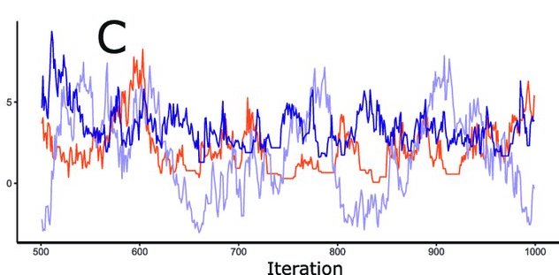

```{r xaringan-extra-styles, echo=FALSE}
library(xaringanExtra)
xaringanExtra::use_extra_styles(
  hover_code_line = TRUE,         #<<
  mute_unhighlighted_code = TRUE  #<<
)
```

```{r setup, include = F}
knitr::opts_chunk$set(warning = FALSE, 
                      message = FALSE, 
                      fig.width = 8,
                      fig.height = 12, 
                      fig.asp = 0.7, 
                      fig.retina = 3, 
                      dpt = 300,
                      out.width = "90%",
                      fig.align = "center")
ggplot2::theme_set(ggplot2::theme_bw(base_size = 22))
colors <- tibble::tibble(green = "#B5BA72")
```

```{r echo=FALSE, message=FALSE, warning=FALSE}
library(tidyverse)
library(tidymodels)
library(GGally)
library(easystats)
library(interactions)
library(ggdist)
library(marginaleffects)
library(performance)
library(kableExtra)
library(ggeffects)
library(lme4)
library(emmeans)
library(broom.mixed)
library(DHARMa)
library(xaringanExtra)
library(knitr)
library(patchwork)
library(viridis)
library(ggfortify)
library(gridExtra)
```

```{r, echo=FALSE, message=FALSE, warning=FALSE}

theme_clean <- function() {
  theme_minimal(base_family = "Arial") +
    theme(panel.grid.minor = element_blank(),
          plot.title = element_text(face = "bold"),
          axis.title = element_text(face = "bold"),
          strip.text = element_text(face = "bold", size = rel(1), hjust = 0),
          strip.background = element_rect(fill = "grey80", color = NA),
          legend.title = element_text(face = "bold"))
}

```

## Today

<br>
<br>

- Understand basic concepts of Bayesian statistics

- Learn how to conduct and interpret a simple Bayesian regression using `brms`

---
## Bayesian statistics as a tool 

.pull-left[

- A lot of discussion on philosophical issues:

  - Subjective vs. objective probabilities
  - Frequentist vs. Bayesian (why I am better than you are)
  - p-values vs. subjective probabilities

]
  
.pull-left[

```{r, fig.align='center', echo=FALSE}


```

]
---
## What is Bayesian data analysis?

- It is when you use probability to represent uncertainty in all parts of a statistical model

--

- A flexible extension of maximum likelihood *(hey I know what that is!)*

--

- Can be computationally intensive
---
## What is Bayesian data analysis?

- A method for figuring out unknowns that requires three things: 

1. Prior (what we know before data is collected)

2. Data

3. Generative models

---
## Generative model

```{r, fig.align='center', echo=FALSE, out.width="65%"}


```
---
## Bayes' therom

$$\begin{align}
\underbrace{ p(\theta \mid \text{data})}_{\substack{\text{Posterior beliefs}}} \,\,\, = \,\,\,
\underbrace{ p(\theta)}_{\substack{\text{Prior beliefs} }}
\,\,\,\, \times
\overbrace{\underbrace{\frac{p( \text{data} \mid \theta)}{p( \text{data})}}}^{\substack{\text{Prediction for specific }\theta }}_{\substack{\text{Average prediction} \\\text{across all }  \theta's}}.
\end{align}$$

- $p(\theta \mid \text{data})$ - The question you always wanted to test (posterior)

- $p(\theta)$ - expectation/prior belief (priors)

- $p(data \mid \theta)$ - How well data fits given estimated parameter value (likelihood)

- $p(data \mid M_k)$ - Marginal likelihood or evidence

---

```{r, fig.align='center', echo=FALSE, out.width="100%"}


```
---
## Bayesian belief updating

```{r, fig.align='center', echo=FALSE}


```

---
## Example

- We are interested in the percentage of dog people in the US

- People can be classified at dog people or cat people

- Data:
  - 0 = Cat person
  - 1 = Dog person

Parameters:
- $\theta$ = Proportion of dog people 

---
## Bayesian belief updating

- Prior Probability

  - An unconditional probability distribution representing belief about a parameter BEFORE DATA COLLECTION

```{r, fig.align='center', echo=FALSE, out.width="70%"}

include_graphics("images/sytep1.png")

```

???

We start off with a prior distribution that captures the state of knowledge about parameters before the data collection. The wider the distribution the less knowledge we have. The most extreme prior someone can have is a point prior (here green) on one value. This means that prior to seeing the data, the person thinks that only this and no other value is technically possible. Different people can have different prior distributions, for example, the blue person has considerable more uncertainty about the prior parameter than the blue person.

---
```{r, fig.align='center', echo=FALSE}


```
---
## Bayesian belief updating

- Prior odds

  - Compares the relative plausibility of two models before data collection

$$\frac{p(M1)}{p(M2)}$$

```{r, fig.align='center', echo=FALSE, out.width="60%"}


```

???

Imagine a third person who is asked to make a judgement about the prior expectations of two people. In most cases, without seeing the data, this third person will be impartial - and thus assign the same prior probabilities to both models. # Note that we are talking of people and models interchangeably.

---
## Declaring Priors

You have to identify:

  - Distribution of every statistic you want to estimate, including the dependent variable and each parameter of its distribution
    - (e.g., DV ~ N( $\mu$ , $\sigma$))
    
- Expected values for the location and spread of the distributions  

---
# How to choose

- People argue about priors
  
  - Priors differ in how informative they are 
  
  - Priors differ in how proper they are

- Creates two camps:

  - “Subjective Bayesians” vs. “Objective Bayesians"
---
## Informativeness of priors

- Informative Priors (“Subjective Bayesians”)

  - Prior distributions that are specific about the values of model parameters  (e.g., true correlation ≈ N(μ = -0.5)

- Non-informative Priors (“Objective Bayesians”)

  - Usually, uniform distributions that includes all values of a parameter (e.g., -1 ≤ true correlation ≤ +1, with every value having equal probability)

- Weakly-informative priors (“WIP”; Most Bayesians)

  - Specifying the distribution (e.g., Normal), with starting values known to  bias estimates the least

---
## Informativeness of priors

- People vary in how strongly they state their prior beliefs

- If you state your belief strongly

  - E.g., the true correlation is ~N(0.3, 0.06)
    - Pitfall: Your beliefs have greater influence over the shape of the posterior distribution

- If you state your belief weakly

  - E.g., true correlation is equally likely at any real value between -1 and 1
    - Pitfall: You run the risk of overestimating the relative densities of the posterior distribution to the prior distribution
---
## Bayesian belief updating

- What is the probability to observe 
0, 1, 2, … dog people in a random sample of 5 people given our model?

```{r, fig.align='center', echo=FALSE}


```
???
From the prior expectations about a parameter we can derive prior predictions for the data (X). For example, if data 0-5 are technically possible, the green model (which was the one with the spike prior) predicts that it is very likely to draw values 2 and 3, whereas it is very unlikely to draw values 0 and 5. On the other hand, the blue model (which contained more uncertainty about the parameter) makes much less precise predictions. All data values are somewhat likely to happen according to this model – even extreme values such as 0 and 5. If we look at the probabilities of all possible data values, we get a prior predictive distribution
---
## Bayesian belief updating

```{r, fig.align='center', echo=FALSE}


```

???
The next step is data collection. Remember that everything we discussed so far happened without any knowledge about real data. As the data roll in, you could get a result like “We tried out procedure X, and were successful in 3 out of 5 trials”. 

---
## Bayesian belief updating

- How plausible are the observed data under the model?

  - Evaluation of the prior predictive distribution at the observed data


```{r, fig.align='center', echo=FALSE}


```

???

As soon as you have the data, you can check how well they fit the predictions of the models. In a Bayesian context, we think of prediction adequacy (or prediction errors) in terms of a match between the model and the data. If the data match the model well, the predictive adequacy is high / the prediction error is low. If there is no good match between model and data, the predictive adequacy is low / the prediction error is high. Now, how can we quantify this “matchingness”? Via the prior predictive distributions:
Here, you can see again the prior predictive distributions of the two models. You can see that for the given data (x = 3), the green model made better predictions than the blue model, because the green model thought that the given data were more likely beforehand. This likelihood of the data under a model is called “marginal likelihood” or “Bayesian evidence”.

---
## Bayesian belief updating


```{r, fig.align='center', echo=FALSE}


```
---
## Bayesian belief updating

```{r, fig.align='center', echo=FALSE}


```

---
```{r, fig.align='center', echo=FALSE}


```

---
## Bayes factors

- Frequentists have *p* values

- Bayesians have Bayes factors (BF)
  
 -  Tells you how much more likely the observed data are under one model than under another model
 
  - Can be interpreted as degree of relative evidence for a model

  - Typically: Spike prior under the null model, distribution under the alternative model


$$\text{Bayes factor} (BF) = \frac{P(\mathcal{D}|H_1)}{P(\mathcal{D}|H_0)}$$

???

$\text{Bayes factor}$ represents the ratio of the likelihood of the data $\mathcal{D}$ under two competing hypotheses $H_1$ and $H_0$. The numerator $P(\mathcal{D}|H_1)$ represents the likelihood of the data under the alternative hypothesis $H_1$, while the denominator $P(\mathcal{D}|H_0)$ represents the likelihood of the data under the null hypothesis $H_0$.

---
## Bayes factors

```{r, fig.align='center', echo=FALSE}


```
---
## Bayesian belief updating

- A posterior distribution is a conditional probability  distribution that represents belief about a parameter, taking the evidence into  account

```{r, fig.align='center', echo=FALSE}


```

???
Let’s see how our knowledge is updated by the data. Remember the two persons from the beginning? One said: Everything apart from a parameter value of 0.5 is literally not possible (see green line). One had considerable uncertainty and did not rule out any parameter value, and therefore formulated a wide prior distribution (here dotted blue). The posterior distribution shows us how these prior expectations should be transformed after seeing the data. Here, the posterior distribution of the blue person is pictured with a blue solid line. There are certain parameter values that gained in plausibility, while others decreased in plausibility. For the “green person”, the prior distribution is not updated at all. Why does that happen? Since the person logically excluded all parameter values apart from 0.5, they also get a probability of zero after seeing the data. Just imagine: If you are 100% sure that Santa Claus does not exist, you won’t believe in him although you find presents in your stocking on Christmas day, get told stories about him, and saw a reindeer with a red nose in your back yard.
---
## Bayesian belief updating

- Credible Intervals (Highest Density Intervals)

  - With a probability of x%, the parameter lies within this interval
  - Defined by the posterior distribution

```{r, fig.align='center', echo=FALSE, out.width="70%"}

knitr::include_graphics("images/step7.png")

```

---
## Bayesian belief updating

```{r, fig.align='center', echo=FALSE, out.width="70%"}


```

???

Of course, after seeing the data, a third person would believe more in the model that predicted the data better (in this case model 1). This means that the posterior odds of the person changed in comparison to the prior odds. How can we quantify how much the belief changed? By multiplying the prior odds with the Bayes factor. Remember that the BF told us how much to believe in one model compared to the other, so this is straightforward: We multiply what we believed before with what we should believe when we see the data and get what we should believe after we have seen the data. In this case, the posterior model odds are 1.46, that means that an impartial judge who had no preference before would think that the green model is 1.46 times more likely than the blue model after seeing the data.

---
## Bayesian belief updating

```{r, fig.align='center', echo=FALSE}


```

---
## Today

<br>
<br>

- `r emo::ji("check")` Understand basic concepts of Bayesian statistics

- Learn how to conduct and interpret a simple Bayesian regression using `brms`

---
## Bayesain regression example 

- Does synchronous attendance matter in hybrid courses?
  
  - 33 students in Fall 2020 statistics course
  
    - Looked at: 

      - Grade `Final course grade`: Max 100
      - sync `Mode of attendance`: (0=asychronous; 1=synchronous)
      - avgView `Average standardized viewing time for recorded lectures`: in minutes
  
---
## Data

```{r}
#can read directly from osf 
data<-read_csv("https://osf.io/sxk2a/download")

```
## Packages
```{r, eval=FALSE}
library(brms) # run bayes lm 
library(emmeans) # get posteriors 
library(ggeffects) # graph
library(easystats) # easystats packages # bayesttestR 
library(bayesplot) # graph trace plots
```

---
##`avgView` plot

```{r, echo=FALSE, out.width="70%"}

# The ggplot function takes the data as argument, and then the variables
# related to aesthetic features such as the x and y axes.
ggplot(data, aes(x = avgView, y = grade)) +
  geom_point() + # This adds the points
  geom_smooth(method = "lm") # This adds a regression line
```

---
## `sync` plot

```{r, echo=FALSE, fig.align='center', out.width="70%"}
library(gghalves)
library(ggokabeito)
library(ggbeeswarm)

data$sync_cat<-ifelse(data$sync==0, "Async", "Sync")
data$sync_cont<-ifelse(data$sync_cat=="Async", -.5, .5)


# Visualise distributions and observations

ggplot(data, aes(x = sync_cat, y = grade)) +
  geom_half_point(aes(color = sync_cat), 
                  transformation = position_quasirandom(width = 0.1),
                  side = "l", size = 0.5, alpha = 0.5) +
  geom_half_boxplot(aes(fill = sync_cat), side = "r") + 
  scale_fill_okabe_ito() +
  scale_color_okabe_ito() +
  guides(color = "none", fill = "none") +
  labs(x = "Sync", y = "Grade") +
  theme_clean()


```

---
## Simple regression

```{r}
lm_class <- lm(grade~avgView+sync_cont, data=data)

kable(tidy(lm_class), digits=3)
```

---
## `brms`

- Bayesian regression models in Stan (`brms`)

```{r, message=F, warning=F,results='hide'}
library(brms)
brm_class1 <- brm(grade~avgView, data=data, 
family= gaussian(),#distribution
prior=NULL, 
chains=4, # how many chains are run
core=4, #computer cores to use
warmup = 2000, # warm-up for MCMC 
iter = 5000) # number of MCMC samples

```

- Let's go to R to run this

---
## Computing the posterior

- Markov chain Monte Carlo (MCMC) sampler!

- Given possible priors and your data, a computer uses a  Monte Carlo sampling technique to build stochastic  Markov Chains, a process referred to as MCMC

- We run multiple chains (e.g., 4 chains in `brms`) with equal numbers of iterations (e.g., 5000 iterations) in each chain to estimate convergence/stability

- MCMC chains contain samples from the posterior distribution of the theory given the data

---
## Markov chains

.pull-left[
```{r, fig.align='center', echo=FALSE}


```
]

.pull-right[
- Chain of discrete events, moving forward in time
  - Probability of each event is a  conditional probability, given the  last event
- Each event is wholly predicted by  the immediately preceding event
- They can stay the same/loop
- Future events can be predicted  by knowing only the current event
]
---
## Differences Between MCMC  and Bootstrapping

- An entire set of bootstrapping resamples would be practically equivalent to one MCMC “chain” in the analysis
- Bootstrap resamples are independent of each other,  MCMC iterations are dependent on each other
- MCMC iterations can get stuck
- The first n iterations or samples in an MCMC chain are  generated as “burn in” samples that will be the priors of the recorded MCMC samples

---
# MCMC in action

```{r}
knitr::include_url("https://chi-feng.github.io/mcmc-demo/app.html")

```

---
## MCMC Diagnostics

- Trace plots

  - Look for the fuzzy catapliers 

```{r, fig.align='center', out.width="40%"}

bayesplot::color_scheme_set("mix-blue-red")
bayesplot::mcmc_trace(brm_class1, pars = c("b_avgView"), 
           facet_args = list(ncol = 1, strip.position = "left"))


```
---
## MCMC Diagnostics

- Bad plots

```{r, echo=F}


```
---
## Other diagnostics

```{r}

kable(diagnostic_posterior(brm_class1), digits=3)
```
- $\hat{R}$

  - Measure of consistency of Markov chains
  
    - Should be close to 1 (not larger than 1.01)
    
  - Ratio of variance (like *F* test)
---
## Other Diagnostics

```{r}

kable(diagnostic_posterior(brm_class1), digits=3)
```

- Effective sample size (ESS)

  - MCMC chains are autocorrelated
  
  - Number of independent pieces there is in autocorrelated chains (Krushke, 2015, p182-3)
  
  - Should be > 1000
---
## Priors

```{r}
prior_summary(brm_class1)
```
---
## Weakly informative priors

.pull-left[

- cauchy(0, .7) 

```{r, fig.align='center', out.width="100%"}

x=distribution_cauchy(100, location=0, scale=.7)

plot(density(x))

```
]

.pull-right[

- normal(0, 10)

```{r, fig.align='center', out.width="100%"}

x=distribution_normal(30, 0, 10)
plot(density(x))

```
]
---
## Resonable Ignorance Priors


- Use empirical rule (95% data will fall within 2 $\sigma$)

- Find maximum effect possible:

  - min-max and divide by 2 
  
  - `avgplot` $\frac{6-75}{2}$

  - http://svmiller.com/blog/2021/02/thinking-about-your-priors-bayesian-analysis/

---
## Visualize prior predictive distribution

- Make sure prior distribution makes sensible predictions (if using informative priors)

.pull-left[
```{r, warning=F, message=F, results='hide'}
# set prior
prior_emp <- c(prior("lognormal(0,.51)", class = "b", lb=0, ub=100))

prior1 <- prior(cauchy(0, .707), class=b)
prior2 <- prior(normal(0, 10), class = b)
prior3 <- prior(normal(0, .51), class = b)

#include prior 
# only sample from prior so we can plot it and look
brm_class_prior <- brm(grade~avgView, data=data,              sample_prior="only", #use this to check prior pulls 
prior=prior_emp, # add in prior information 
family= gaussian(),  
warmup = 2000,
iter = 5000)

# check prior

```
]

.pull-right[

```{r, fig.align='center', out.width="100%"}

pp_check(brm_class_prior)

```

]
---
##  Visualing the posterior distribution

```{r,fig.align='center', out.width="50%"}
posteriors <- get_parameters(brm_class1)

ggplot(posteriors, aes(x = b_avgView)) +
  geom_density(fill = "orange")

```
---
## Describing the Posterior

1. A point-estimate which is a one-value summary (similar to the $\beta$ in frequentist regressions)
 
2. A credible interval representing the associated uncertainty

3. Some indices of significance, giving information about the relative importance of this effect (e.g., Bayes Factors)
---
## Point-estimate

```{r}
describe_posterior(
  brm_class1,
  effects = "all",
  component = "all",
  centrality = "all"
)

```

---
## Uncertainty: Credible intervals

.pull-left[
- Credible intervals (high density intervals)

  - Common to use 89% HDIs (why?)
    - Provides more stable estimates
    - If 95%, need to increase number of iterations
    
]

.pull-right[
```{r}
posteriors <- get_parameters(brm_class1)
resuls=hdi(posteriors$b_avgView, ci=0.89)
```

```{r, echo=F, fig.align='center', out.width="100%"}


```
]

---
## Visualizing uncertainty

.pull-left[
```{r, echo=T,results='hide'}

pred <- predictions(brm_class1,
                    newdata = datagrid(
        avgView = seq(6, 75, by = 5))) %>%
        posterior_draws()

pred_fig <- ggplot(pred, aes(x = avgView, y = draw)) +
    stat_lineribbon() +
    scale_fill_brewer(palette = "Reds") +
    labs(x = "Average Watch Time (min)",
         y = "Grades (predicted)",
         fill = "")


```
]


.pull-right[


```{r, echo=F, fig.align='center', out.width="100%"}

pred_fig 

```
]
---
## Significance

- Does the credible interval contain 0?

  - If yes, "not significant"
  
  - If no, "significant"


---
## Significance

- Test if effect is greater than 0, or equal to 0

```{r, echo=T, results='hide', warning=FALSE, message=FALSE}
brm_class_pr <- brm(grade~avgView, data=data,#use this to check prior pulls
prior=prior2,
sample_prior = TRUE, 
family= gaussian(),  
warmup = 2000,
iter = 5000)
```

```{r}
BF <- bayestestR::bayesfactor_parameters(brm_class_pr, null=0)

BF

```

---
## Adding categorical predictor

- `avgView` seems to have an effect on grades

- Let's add `sync` to our model

```{r, message=FALSE, warning=FALSE, echo=TRUE, results='hide'}

brm_class_cat <- brm(grade~avgView + sync_cont, prior=prior2, 
data=data,
family=gaussian(), 
sample_prior="yes")

```

```{r, echo=FALSE, results='hide'}

brm_class <- brm(grade~avgView + sync_cat, data=data,
                sample_prior="yes", family=gaussian(), prior=prior2)

```

`r kable(tidy(brm_class_cat),digits = 3)`

---
## Posterior distribution plot 

```{r, fig.align='center', out.width="60%"}

pp_check(brm_class_cat, type="stat_grouped", group="sync_cont")

```

---
## Point-estimate

```{r}

describe_posterior(
  brm_class_cat,
  effects = "fixed",
  component = "all",
  centrality = "all"
)

```

---
## Uncertainty: Credible intervals


.pull-left[

- Credible intervals (HDI)
]

.pull-right[
```{r}
library(see)

posteriors <- get_parameters(brm_class_cat)
results=hdi(posteriors$b_sync_cont, ci=0.89)

```

```{r, echo=F, fig.align='center', out.width="100%"}


```

```

]

---
## Significance

- Does the credible interval contain 0?

  - If yes, "not significant"
  
  - If no, "significant"

---
## Significant differences

- Use `emmeans` to get mean differences between variables 

```{r}

em_syn <- emmeans(brm_class, ~sync_cat) %>% 
  pairs() %>%
  kable("html")

em_syn
```

---
## Significant differences

- Is the effect 0?

```{r, warning=F, message=F}
library(bayestestR) # bayes functions easystats
# contrast
#BF only if you use weakly-strong priors 
BF <- bayestestR::bayesfactor_parameters(brm_class_cat, null = 0)

BF

```

---
## Model comparisons

- Use `bayestestR::bayesfactor_models` to get a BF for model selection

```{r, echo=TRUE, message=F, warning=F, results='hide'}
# Model 1: grade ~ sync + avgView
#save_pars for bayes factors
brm_class1 <- brm(grade~avgView + sync, data=data , family = gaussian(),prior=prior2, sample_prior="yes", save_pars = save_pars(all=TRUE), warmup = 2000, iter = 5000, refresh=0)
#grade ~ avgView
brm_class2 <- brm(grade~avgView, data=data, prior=prior2, family = gaussian(), sample_prior="yes", save_pars = save_pars(all=TRUE), refresh=0, 
    warmup = 2000, iter = 5000)
```

```{r}
# testing models
# compared to intercept-only or null model
bayesfactor_models(brm_class1, brm_class2)

```
---
## Original question

- Do my students’ course grades depend on whether they attend lectures synchronously or asynchronously?
  - Maybe?
    - BF for model comparison suggests equivocal evidence
    - Average viewing time does matter
      - Moderate evidence that effect not zero (BF = 3.47)
    
- What do we get from Bayesian analysis that we don't get from regular linear regression?

---
## Reporting bayesian analysis

```{r, echo=T, message=F, warning=F, results='hide', eval=F}
report_bayes=report::report(brm_class1)
```
1. Include which prior settings were used
2. Justify the prior settings (particularly for informed priors in a testing scenario) 
3. Include a plot of the prior and posterior distribution
4. Report the posterior mean/median and x% credible interva
5. Include which prior settings were used
6. If relevant, report the results from both estimation and hypothesis testing 
7. Include BFs for model comparisons or parameters
8. Include model convergence diagnostics (trace plot, $\hatR$, ESS)

---
## Bayesian pros 

- Evidence can be gathered in favor of a hypothesis (the null)

- Quantify the amount of support for one hypothesis relative to another

- Parsimony is rewarded

- Sample size does not affect estimates as much as it does the likelihood

- Optional stopping is okay
---
## Bayesian cons: 

- Priors

- Computationaly intensive

---
## Caveat: What can Bayes not do?

- Ban questionable research practices (e.g., HARKing)

- Provide a remedy for:

  - Small sample sizes
  - Unrepresentative samples
  - Poor experimental design
